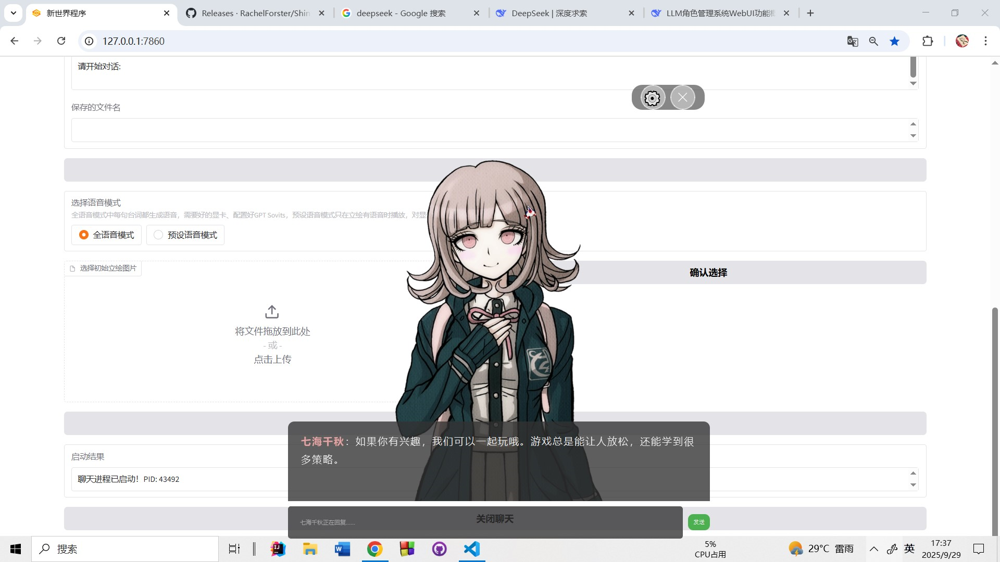

[中文版](README.md) | [English Version](docs/README_EN.md)

# 新世界程序

> AI galgame/乙女游戏/RPG游戏，接入大语言模型，自动切换立绘，支持语音合成

## 核心功能

### AI角色管理
- **角色创建与配置**
  - 自定义角色立绘，语音，和设定
  - AI辅助生成角色背景故事和性格设定
  - 支持角色导入/导出，方便分享

### 立绘系统
- **视觉展示**
  - 多张立绘上传和管理
  - 立绘缩放调节（0-3倍可调）

- **情绪标注**
  - 为每张立绘标注情绪关键词
  - 智能情绪与立绘匹配

### 语音系统
- **双模式支持**
  - **全语音模式**：每句台词实时生成语音（需GPT-SoVITS）
  - **预设语音模式**：播放预先上传的语音文件



[](https://www.bilibili.com/video/BV15H4y1o73x/?share_source=copy_web&vd_source=4641a345db4563ba087d0ed0ba8bdf85)
[](https://www.bilibili.com/video/BV1Hp4y1c7TU/?share_source=copy_web&vd_source=4641a345db4563ba087d0ed0ba8bdf85)

**视频教程：制作中...0.0**

## 快速使用
### 获取项目
- git clone本项目
```
git clone https://github.com/RachelForster/Shinsekai
```
- 或者：下载整合包并解压：https://github.com/RachelForster/Shinsekai/releases 

### 安装依赖库
如果是整合包，请双击install.bat
1. 创建并激活虚拟环境  
```
conda create -n shinsekai python=3.10
conda activate shinkekai
```
2. 然后在项目目录下执行以下命令  
```
pip install -r requirements.txt
```
### 开始使用
如果是整合包，双击start.bat则可以开启Web ui
1. 在项目目录下执行：
```
python webui.py
```

### 下载GPT-SOVITS整合包(可选)  
如果你需要角色读出台词，则需要下载该整合包
GPT-SOVITS 项目地址：https://github.com/RVC-Boss/GPT-SoVITS

### 快速体验
1. 切换到 ``聊天模板`` 标签页，从下拉框中选择nanami.txt，点击加载模板
2. 点击``启动聊天``按钮，你会看见一个默认的弹窗
3. 发送消息，七海就会回复你了

## 配置API
### 1. 进入 API 设定页面
打开程序后，点击顶部的 "API 设定" 标签页

### 2. 配置大语言模型 (LLM)
1. **选择大语言模型供应商**: 从下拉菜单中选择 "Deepseek"（其他的也可以）
2. **模型ID**: 输入 Deepseek 模型名称（如 deepseek-chat）
3. **LLM API Key**: 输入从 Deepseek 获取的 API 密钥 (下面有教程)
4. **LLM API 基础网址**: 程序会自动填充 Deepseek 的 API 地址

### 如何从 Deepseek 获取 API Key，其他的也类似
#### 步骤 1: 注册 Deepseek 账户
1. 访问 Deepseek 官方网站 (https://platform.deepseek.com/)
2. 点击注册并创建账户
#### 步骤 2: 获取 API Key
1. 登录 Deepseek 控制台
2. 进入 "API Keys" 管理页面
3. 点击 "Create new API key"
4. 为密钥命名（如"shinsekai"）
5. 复制生成的 API Key（注意：密钥只显示一次，请妥善保存）填写到LLM API Key里
#### 步骤 3: 查看可用模型
1. 在 Deepseek 文档中查看当前可用的模型列表
2. 常用的模型包括：deepseek-chat、deepseek-reasoner 等
3. 将模型名称填写到程序的"模型ID"字段中