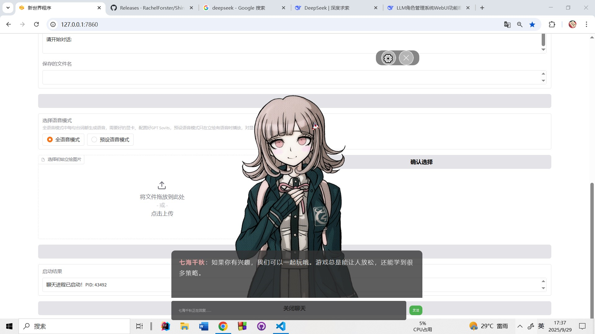

[中文版](README.md) | [English Version](https://github.com/RachelForster/Shinsekai/blob/main/docs/README_EN.md)

# 新世界（Shinsekai）

面向 **Galgame / 乙女 / 剧情向 RPG** 的桌面助手：用大语言模型驱动角色对白，**立绘与情绪联动**，并可接入 **语音合成**、**语音识别** 与 **视觉、工具** 等扩展——一切在本地 Settings 里配置，聊天窗口专注演出。

---

## 为什么用它

- **角色演出一条龙**：聊天模板、会话历史、立绘切图与情绪、TTS/ASR 与输入管线在同一套工作流里衔接，减少到处换工具。  
- **双窗分工**：**设置中心**（`webui.py` / 整合包）集中管 API、角色、插件；**聊天主窗**专责对白与演出，思路清晰。  
- **多模型、可换引擎**：在 **API 设定** 对接常见 LLM 与 OpenAI 兼容端点；**TTS** 含 GPT-SoVITS、Genie TTS 等，无独显也可选轻量方案；**文生图**可接 ComfyUI 等工作流（同页配置）。  
- **听懂与说出口**：麦克风 **ASR**（如 Vosk；更多后端可装**插件**）与台词 **TTS** 可选开关，适配「只打字」「只朗读立绘音频」等多种玩法。  
- **模型不仅会聊天**：内置/插件 **LLM 工具**（如角色与世界书相关能力）+ **MCP** 接入外部服务，把检索、自动化等能力收进同一次对话。  
- **可扩展、可换肤**：**插件 SDK** 扩展适配器与设置页、聊天栏控件；主题与聊天窗样式可通过配置与插件微调（如 `chat_ui_theme`）。  
- **数据在本地、可备份**：配置与资源默认落在项目 **`data/`** 下（`api.yaml`、`system_config.yaml`、角色与历史等），便于打包备份与二次开发。  
- **开源可玩**：源码与 [发行版整合包](https://github.com/RachelForster/Shinsekai/releases) 任选；社区插件索引见 [Shinsekai-Plugin-Registry](https://github.com/RachelForster/Shinsekai-Plugin-Registry)。

---

## 效果预览


[](https://www.bilibili.com/video/BV1V4H7z5Ez7/)
[](https://www.bilibili.com/video/BV1Hp4y1c7TU/?share_source=copy_web&vd_source=4641a345db4563ba087d0ed0ba8bdf85)

**教程：** [配置 API 与导入角色包](https://www.bilibili.com/video/BV1V4H7z5Ez7/)

---

## 核心能力一览

| 模块 | 说明 |
|------|------|
| **角色与模板** | 创建 / 导入导出角色包（`.char`）；AI 辅助生成设定与背景；**聊天模板**一键套用多角色与世界书；会话 **历史** 读写、回溯与存档。 |
| **立绘与演出** | 多张三宣图 / 立绘管理；**0–3 倍**缩放；为每张图打 **情绪标签**，对白中的情绪指令与立绘切换联动；可选 CG / 特效字段（视模板与管线）。 |
| **语音** | **TTS**：GPT-SoVITS、Genie TTS、CosyVoice 等（**API 设定**中选引擎并填服务路径/URL）；选「不使用」时可仅播放 **立绘绑定的台词音频**。**ASR**：麦克风识别默认可走 **Vosk**；Whisper 类等可通过 **插件** 注册。 |
| **LLM 与工具** | **API 设定**中配置供应商、**模型 ID**、Key、Base URL；支持 **流式**输出与 **工具调用**；工具来源包括内置/插件 **`@tool`** 与 **MCP**（`data/config/mcp.yaml`）。 |
| **文生图（T2I）** | 在 **API 设定**中配置 **ComfyUI** 等服务端地址、工作流与节点 ID；可按需接入其他 **T2I 适配器**（插件注册）。 |
| **设置与系统集成** | **PySide** 设置界面集中管理 **API**（`data/config/api.yaml`）与 **系统**（`data/config/system_config.yaml`）：界面语言、语音识别后端、主题色、字体等。 |
| **插件** | `data/config/plugins.yaml` 清单加载；**插件**页发现/安装、启用禁用；扩展 LLM/TTS/ASR/T2I、工具与 **Settings / 工具箱 / 聊天窗** 入口。 |
| **MCP** | **插件 → MCP** 子页或 YAML 连接远端/本机 MCP Server（SSE / stdio），工具并入当前进程的 LLM 工具列表。 |
| **视觉与其它扩展** | 视觉理解、主题编辑等能力可通过 **官方或社区插件** 启用（如仓库内 `plugins/` 示例）；具体能力以各插件说明为准。 |

---
## 快速开始（约 5 分钟）

### 1. 获取程序

**源码：**

```bash
git clone https://github.com/RachelForster/Shinsekai
cd Shinsekai
```

**整合包：** 从 [Releases](https://github.com/RachelForster/Shinsekai/releases) 下载解压；内置 `install.bat` / `start.bat`。

### 2. 安装依赖

整合包用户：双击 `install.bat`。

开发者建议 Python 3.10 虚拟环境：

```bash
conda create -n shinsekai python=3.10
conda activate shinsekai
pip install -r requirements.txt
```

### 3. 打开设置界面

整合包：`start.bat`。源码：

```bash
python webui_qt.py
```

### 4. 第一次对话

1. 在 **API 设定** 中填写 LLM（例如 DeepSeek / OpenAI 兼容端点），保存。  
2. 在 **角色管理** 导入角色包（示例：[nanami.char](https://github.com/RachelForster/Shinsekai/releases/download/v1.0.4/nanami.char)）。  
3. 打开 **聊天模板**，勾选角色并生成模板。  
4. **启动聊天**，即可在主窗口发消息、看立绘与回复。

### 可选：让角色开口说话

需要台词语音合成时，可部署 [GPT-SoVITS](https://github.com/RVC-Boss/GPT-SoVITS)；机器较弱或无独显时，可在 API 设定中改用 **Genie TTS** 等方案。

---

## 配置 LLM（简要）

1. 顶部进入 **API 设定**。  
2. 选择供应商，填写 **模型 ID**、**API Key**、**Base URL**（部分供应商会自动填默认地址）。  
3. 保存后回到聊天流程即可使用。

---

## 插件系统

用 **`data/config/plugins.yaml`** 登记插件；源码放在 **`plugins/<包名>/`**。宿主会合并 **LLM / TTS / ASR / T2I** 适配器、**工具**、**Settings / 工具箱 / 聊天窗** 等贡献。

- **图形界面**：Settings → **插件**：启用/禁用、从索引发现与下载、`pip install` 依赖（与当前解释器一致）。  
- **索引仓库**：[Shinsekai-Plugin-Registry](https://github.com/RachelForster/Shinsekai-Plugin-Registry)  
- **脚手架**：`python -m sdk.cli create --package your_plugin_name`  
- **设计说明**（英文）：[docs/PLUGIN_DEVELOPER_GUIDE.md](docs/PLUGIN_DEVELOPER_GUIDE.md)

修改清单后请 **重启应用** 以加载插件。

---

## MCP（模型上下文协议）

将 [MCP](https://modelcontextprotocol.io/) 服务接入 **本进程 LLM 工具列表**：支持 **SSE** 与 **stdio** 等传输方式。

1. 安装：`pip install mcp`  
2. 配置：**`data/config/mcp.yaml`**，或在 Settings → **插件** → **MCP** 子页可视化编辑。  
3. **保存并应用** 会重连服务并把远端工具注册到当前会话（可用前缀避免工具名冲突）。

与插件系统独立：不写插件也能通过 YAML 接外部能力。

---

## 文档与链接

| 内容 | 链接 |
|------|------|
| **图形界面使用指南（新手）** | [docs/GUI_USER_GUIDE_zh-CN.md](docs/GUI_USER_GUIDE_zh-CN.md) |
| 英文说明 | [docs/README_EN.md](docs/README_EN.md) |
| 插件开发者指南 | [docs/PLUGIN_DEVELOPER_GUIDE.md](docs/PLUGIN_DEVELOPER_GUIDE.md) |
| 本仓库 | [github.com/RachelForster/Shinsekai](https://github.com/RachelForster/Shinsekai) |

欢迎 Issue / PR；若二次分发角色与语音资源，请遵守对应作者许可。
