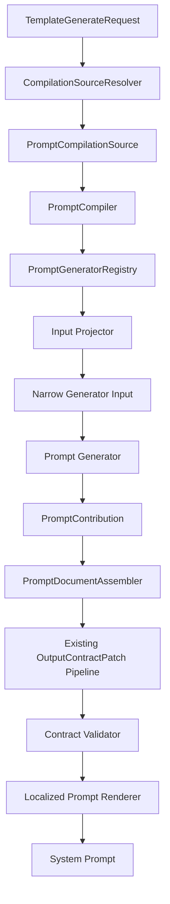

# Template Generator 注册式 Prompt 编译器设计

## 1. 摘要

当前 `template_generator.py` 实际上不是调用 LLM 生成模板，而是把角色、背景、功能开关、工具、插件补丁和本地化文案组合成运行时 system prompt。本文建议将其重构为一个注册式 Prompt Compiler：

- Prompt Generator 只处理一个明确的 Prompt 片段。
- 每个 Generator 只接收自己的窄输入 DTO，不读取完整编译上下文。
- Registry 保存 Generator 的 ID、阶段、优先级、适用 Profile 和输入投影器。
- Compiler 是唯一能够访问完整编译上下文并协调所有 Generator 的组件。
- Generator 返回结构化 `PromptContribution`，不直接修改其他 Generator 的文本。
- 继续使用现有 `OutputFieldSpec`、`RequirementSpec`、`OutputContractPatch` 和插件接口，不修改现有 Output Contract 公共契约。
- 自由聊天和剧情模式共享同一个 Output Contract 构造与渲染流程，只注册不同的 Prompt Generator。

该设计的核心模式是：

- Registry：注册可用的 Prompt Generator。
- Ordered Contributor Pipeline：按阶段和优先级执行贡献者。
- Builder/Assembler：把多个结构化贡献组装成 Prompt Document。
- Strategy/Profile：表达自由聊天和剧情模式的差异。
- Adapter：将 Generator 产生的 Contract 贡献适配到现有 `OutputContractPatch`。
- Dependency Injection + Interface Segregation：Generator 只依赖自己的输入和必要服务。

## 2. 背景与现状

当前实现主要存在以下问题：

1. `TemplateGenerator.generate_chat_template()` 同时负责角色解析、字段定义、规则定义、背景资料、立绘资料、工具描述、插件补丁、本地化和最终字符串拼接。
2. `generate_chat_template()` 与 `render_dialog_reply_contract()` 重复维护大量 Output Contract 字段及 Requirement 逻辑。
3. `use_effect`、`use_cg`、`use_choice`、`use_stat` 等布尔参数不断增加，使方法签名和条件分支持续膨胀。
4. 前端收到模板后，通过搜索“可用音效”“可调用工具”等自然语言锚点修改 system prompt，容易受语言和文案变化影响。
5. `effectNames` 已作为结构化参数发送到后端，但模板生成入口没有完整消费它。
6. 模板生成依赖全局 `config_manager`，并可能在生成过程中保存语音语言配置，使确定性编译混入全局状态修改。
7. 普通 Prompt 内容、Output Contract、插件扩展和运行时字段处理之间的边界不清晰。

## 3. 目标

### 3.1 功能目标

- 可以独立注册角色、背景、音效、工具、输出要求等 Generator。
- 每个 Generator 只接收与自身相关的数据。
- Generator 可以贡献普通 Prompt Section，也可以通过现有 `OutputContractPatch` 贡献 JSON 字段或 Requirement。
- 支持稳定、可预测、可测试的执行顺序。
- 自由聊天和剧情模式复用同一套 Contract 构造逻辑。
- 插件继续使用现有 Output Contract 扩展 API。
- 最终 Prompt 在迁移期间保持向后兼容。

### 3.2 质量目标

- 同一输入产生稳定输出。
- 单个 Generator 可以独立单元测试。
- Generator 的异常能够定位到稳定 ID。
- 不允许通过字符串搜索修改其他 Generator 的输出。
- 新增功能时不需要修改一个巨大的 `generate_chat_template()`。

## 4. 非目标

- 本次设计不修改 LLM 对话 JSON 的运行时解析协议。
- 不修改 `OutputFieldSpec`、`RequirementSpec`、`OutputContractPatch` 或 `ChatOutputContract` 的公共定义。
- 不自动赋予自定义 JSON 字段运行时语义。字段的解析和执行仍由对应运行时处理器负责。
- 不在第一阶段移除现有 `TemplateGenerator.generate_chat_template()` 公共入口；它将作为兼容 Facade 保留。
- 不让插件直接获得或修改完整 Prompt Document。

## 5. 总体架构



只有 `CompilationSourceResolver` 和 `PromptCompiler` 知道完整上下文。Prompt Generator 只看到注册时投影出的窄输入 DTO。

## 6. 核心领域模型

### 6.1 完整编译源

完整编译源是 Compiler 内部模型，不暴露给 Generator：

```python
@dataclass(frozen=True)
class PromptCompilationSource:
    profile: str
    language: str
    voice_language: str
    characters: tuple[CharacterConfig, ...]
    background: BackgroundConfig | None
    effects: tuple[EffectConfig, ...]
    tools: tuple[ToolDescription, ...]
    features: PromptFeatures
    limits: PromptLimits
    output_contract_patches: tuple[OutputContractPatch, ...]
```

该类型只用于解析和协调，不传给具体 Generator。

### 6.2 窄输入 DTO

每个 Generator 定义自己的输入：

```python
@dataclass(frozen=True)
class CharacterPromptInput:
    characters: tuple[CharacterConfig, ...]
    language: str


@dataclass(frozen=True)
class EffectPromptInput:
    enabled: bool
    effects: tuple[EffectConfig, ...]
    language: str


@dataclass(frozen=True)
class BackgroundPromptInput:
    background: BackgroundConfig | None
    include_bgm: bool
    language: str
```

如果 Generator 后续确实需要新数据，应显式扩展自己的 DTO，而不是改为接收完整 Context。

### 6.3 Prompt Section

普通 Prompt 文本使用结构化 Section 表达：

```python
@dataclass(frozen=True)
class PromptSection:
    id: str
    content: str
```

Section 的阶段和优先级属于注册信息，不属于文本本身。

### 6.4 Prompt Contribution

Generator 可以同时贡献普通文本和现有 Contract Patch：

```python
@dataclass(frozen=True)
class PromptContribution:
    sections: tuple[PromptSection, ...] = ()
    contract_patch: OutputContractPatch | None = None
```

普通 Generator 不获得可变 Prompt Builder，也不能直接删除或修改其他 Generator 的 Section。

## 7. Generator 接口

```python
InputT = TypeVar("InputT")


class PromptGenerator(Protocol[InputT]):
    def generate(self, data: InputT) -> PromptContribution | None:
        ...
```

Generator 应尽量是纯函数：

- 不读取全局 `config_manager`。
- 不保存系统配置。
- 不访问 Registry。
- 不读取其他 Generator 的输出。
- 不依赖最终 Prompt 中的自然语言标题或文本位置。

翻译器、日志器等稳定服务通过构造函数注入：

```python
class EffectPromptGenerator:
    def __init__(self, translator: TemplateTranslator) -> None:
        self._translator = translator

    def generate(self, data: EffectPromptInput) -> PromptContribution | None:
        ...
```

## 8. 注册模型

### 8.1 阶段

仅依赖单个全局数字优先级容易产生隐式耦合，因此使用“阶段 + 阶段内优先级 + ID”的稳定顺序：

```python
class PromptPhase(IntEnum):
    OUTPUT_FORMAT = 100
    CAST_CONTEXT = 200
    WORLD_CONTEXT = 300
    CAPABILITIES = 400
    TOOLS = 500
    REQUIREMENTS = 600
    CLOSING = 900
```

最终排序键：

```python
(registration.phase, registration.priority, registration.id)
```

ID 用于相同优先级下的确定性排序，同时用于错误报告和重复注册检测。

### 8.2 注册信息

```python
@dataclass(frozen=True)
class PromptRegistration(Generic[InputT]):
    id: str
    phase: PromptPhase
    priority: int
    profiles: frozenset[str]
    select_input: Callable[[PromptCompilationSource], InputT | None]
    generator: PromptGenerator[InputT]
    required: bool = False
```

优先级和 Profile 属于“如何参与编译流程”，因此放在 Registration，而不是 Generator 内部。

### 8.3 类型擦除边界

Registry 内需要保存不同输入类型的 Generator。泛型类型检查在 `register()` 时完成，Registry 内部保存已经绑定的执行函数：

```python
class PromptGeneratorRegistry:
    def register(
        self,
        *,
        id: str,
        phase: PromptPhase,
        priority: int,
        profiles: frozenset[str],
        select_input: Callable[[PromptCompilationSource], InputT | None],
        generator: PromptGenerator[InputT],
        required: bool = False,
    ) -> None:
        def contribute(source: PromptCompilationSource) -> PromptContribution | None:
            data = select_input(source)
            if data is None:
                return None
            return generator.generate(data)

        self._store_erased_registration(
            id=id,
            phase=phase,
            priority=priority,
            profiles=profiles,
            contribute=contribute,
            required=required,
        )
```

Generator 本身仍保持完整的窄输入类型信息。

## 9. 注册示例

### 9.1 Character Generator

```python
registry.register(
    id="core.characters",
    phase=PromptPhase.CAST_CONTEXT,
    priority=100,
    profiles=frozenset({"free_chat", "story"}),
    select_input=lambda source: CharacterPromptInput(
        characters=source.characters,
        language=source.language,
    ),
    generator=CharacterPromptGenerator(translator),
    required=True,
)
```

### 9.2 Effect Generator

```python
registry.register(
    id="core.effects",
    phase=PromptPhase.CAPABILITIES,
    priority=200,
    profiles=frozenset({"free_chat", "story"}),
    select_input=lambda source: EffectPromptInput(
        enabled=source.features.use_effect,
        effects=source.effects,
        language=source.language,
    ),
    generator=EffectPromptGenerator(translator),
)
```

Effect Generator 不知道角色、背景、CG、Choice 或完整 Output Contract。

## 10. Output Contract 兼容设计

### 10.1 保留现有公共类型

以下现有类型和接口保持不变：

- `DEFAULT_DIALOG_CONTRACT_ID`
- `OutputFieldSpec`
- `RequirementSpec`
- `FieldPatch`
- `RequirementPatch`
- `OutputContractPatch`
- `ChatOutputContract`
- 插件 Output Contract Patch 注册接口

新增 Pipeline 只负责生产和收集现有 `OutputContractPatch`。

### 10.2 基础 Contract

基础 Contract 仍由核心代码拥有，包含受保护字段：

- `character_name`
- `sprite`
- `speech`

这些字段不能被普通 Generator 或插件删除。现有保护行为必须保留。

### 10.3 Generator 贡献 Contract Patch

例如 Effect Generator：

```python
class EffectPromptGenerator:
    def generate(self, data: EffectPromptInput) -> PromptContribution | None:
        if not data.enabled:
            return None

        return PromptContribution(
            sections=(
                PromptSection(
                    id="available_effects",
                    content=render_available_effects(data.effects),
                ),
            ),
            contract_patch=OutputContractPatch(
                id="core.prompt.effects",
                target_contract=DEFAULT_DIALOG_CONTRACT_ID,
                priority=170,
                add_fields=(
                    OutputFieldSpec(
                        key="effect",
                        type="string",
                        description=translate("r_effect"),
                        required=False,
                    ),
                ),
                add_requirements=(
                    RequirementSpec(
                        id="r_effect",
                        text=translate("r_effect"),
                        order=170,
                    ),
                ),
            ),
        )
```

### 10.4 Patch 应用顺序

为保持插件覆盖核心行为的现有语义，Patch 分两层应用：

1. 从基础 Contract 开始。
2. 应用内置 Prompt Generator 产生的 Patch。
3. 按现有 `priority` 规则应用插件 Patch。
4. 执行 Contract 校验。
5. 使用唯一 Renderer 输出格式说明和 Requirement 文本。

内置 Generator 的注册优先级决定其执行和 Section 顺序；插件 Patch 的 `priority` 只在插件 Patch 层内排序。

### 10.5 冲突规则

- Registration ID 必须唯一，重复注册立即报错。
- Prompt Section ID 在同一 Profile 的最终文档中必须唯一。
- 内置 Generator 添加重复字段 key 时立即报错，不静默覆盖。
- 内置 Generator 添加重复 Requirement ID 时立即报错。
- 插件修改仍使用现有 `field_patches` 和 `requirement_patches` 语义。
- 插件不能删除受保护字段。
- `field_patches` 指向不存在字段时记录结构化警告。
- `requirement_patches` 指向不存在 Requirement 时记录结构化警告。
- 最终 Requirement 按 `(order, id)` 排序。
- 最终 Contract 必须经过必需字段、重复 ID 和字段类型校验。

### 10.6 Contract 与运行时行为

`OutputContractPatch` 只描述 LLM 输出格式和要求，不自动注册运行时行为。例如添加 `emotion` 字段不会自动切换立绘；需要由独立运行时字段处理器解释它。

## 11. Prompt Document 组装

```python
@dataclass(frozen=True)
class PromptDocument:
    sections: tuple[PromptSection, ...]
    format_block: str
    requirements_block: str
```

Assembler 负责：

- 收集非空 Contribution。
- 验证 Section ID。
- 收集内置 Contract Patch。
- 调用统一 Output Contract 构造器。
- 生成结构化 Prompt Document。

Renderer 负责：

- 按已排序 Section 输出文本。
- 统一空行和标题格式。
- 保证 JSON 格式提醒位于结尾。
- 保证相同输入产生字节级稳定输出。

普通 Generator 不负责全局空行、最终结束提醒或文档级格式。

## 12. Profile 与模式差异

自由聊天和剧情模式使用相同 Registry 和 Compiler，但选择不同 Profile：

```python
free_prompt = compiler.compile(source, profile="free_chat")
story_prompt = compiler.compile(source, profile="story")
```

可通过以下方式表达差异：

- Registration 的 `profiles` 属性。
- 不同 Profile 使用不同输入投影器。
- Profile 自己提供少量专属 Generator，例如剧情阶段上下文或隐藏目标。

禁止重新实现一套独立的 Output Contract Builder。自由聊天和剧情模式必须共享：

- 基础字段定义。
- Requirement 构造。
- Contract Patch 应用。
- Contract 校验。
- Contract Renderer。

## 13. 前后端边界

前端只发送结构化生成请求：

```json
{
  "characters": ["Mio", "Aoi"],
  "backgroundName": "Classroom",
  "effectNames": ["Rain", "Door"],
  "useEffect": true,
  "useChoice": true,
  "voiceLanguage": "ja"
}
```

后端负责解析资源并生成完整 system prompt。前端不再：

- 搜索“可用音效”字符串。
- 搜索“可调用工具”字符串。
- 删除旧 Prompt 段落。
- 把新段落插入某个自然语言标题前。

模板编辑器仍可允许用户手动修改生成后的 system prompt，但结构化参数变化后重新生成时，以后端 Compiler 输出为准。

## 14. 错误处理与可观测性

建议使用稳定错误信息：

```text
prompt.generator.duplicate_id
prompt.generator.input_failed
prompt.generator.generate_failed
prompt.section.duplicate_id
prompt.contract.duplicate_field
prompt.contract.duplicate_requirement
prompt.contract.patch_target_missing
prompt.contract.protected_field
prompt.contract.validation_failed
```

日志至少包含：

- `profile`
- `generator_id`
- `phase`
- `priority`
- `contract_patch_id`
- `duration_ms`

不得记录完整角色隐私内容或完整 system prompt，除非明确处于开发调试模式。

Required Generator 失败时终止编译；Optional Generator 失败是否降级必须由注册策略明确指定，不能静默吞掉异常。

## 15. 建议代码布局

```text
ai/llm/
├── template_generator.py          # 兼容 Facade，迁移完成后保持薄层
├── TEMPLATE_GENERATOR_DESIGN.md
└── prompt_compiler/
    ├── __init__.py
    ├── models.py                  # Source、Section、Contribution、Profile
    ├── registry.py                # Registration 与排序
    ├── compiler.py                # 编译流程
    ├── contract.py                # 现有 Contract Patch 的统一应用与校验
    ├── renderer.py                # 本地化 Prompt 渲染
    ├── resolvers.py               # 角色、背景、音效、工具解析
    └── generators/
        ├── characters.py
        ├── sprites.py
        ├── background.py
        ├── effects.py
        ├── tools.py
        ├── requirements.py
        └── closing.py
```

## 16. 渐进迁移方案

### 阶段 0：锁定现有输出

- 为典型自由聊天组合增加 golden/snapshot 测试。
- 覆盖透明背景、真实背景、多角色、Effect、CG、Choice、Stat、Translation、CoT 和限制参数。
- 覆盖插件字段与 Requirement Patch。
- 锁定剧情模式 Contract 输出。

### 阶段 1：提取统一 Contract 构造器

- 把 `generate_chat_template()` 与 `render_dialog_reply_contract()` 重复的字段、Requirement 和 Patch 逻辑提取到唯一内部函数。
- 保持函数签名和最终输出不变。
- 现有 `TemplateGenerator` 继续作为调用入口。

### 阶段 2：引入 Registry 和 Prompt Document

- 新增模型、Registry、Compiler、Assembler 和 Renderer。
- 先迁移 Character、Sprite、Background 和 Tools Section。
- 旧入口把位置参数转换为 `PromptCompilationSource`，再调用 Compiler。

### 阶段 3：迁移可选功能

- 依次迁移 Translation、Effect、CG、Choice、Narration、Stat 和 CoT。
- 每迁移一个功能，同时迁移其 Section 和现有 Contract Patch 贡献。
- 每一步进行新旧 Prompt 字节级或语义级对比。

### 阶段 4：移除前端字符串注入

- 后端根据 `effectNames` 生成音效 Section。
- 删除前端对“可用音效”和“可调用工具”的字符串搜索及插入。
- 保留前端结构化选项和手动 Prompt 编辑能力。

### 阶段 5：统一剧情模式

- 剧情模式改用同一 Compiler 和 Contract 构造器。
- 剧情专属场景、进度、工具和工作流由 Profile 专属 Generator 贡献。
- 删除重复 Contract 渲染代码。

### 阶段 6：清理全局依赖

- Resolver 显式注入 Config Repository、Tool Registry 和 Translator。
- 编译过程不保存 `voice_language` 或其他全局配置。
- API 层决定是否单独保存用户配置，Compiler 只消费请求值。

## 17. 测试策略

### 17.1 Generator 单元测试

- 每个 Generator 只构造自己的窄输入 DTO。
- 验证启用、禁用和空输入。
- 验证只产生声明的 Section 和 Contract Patch。
- 验证 Generator 不依赖其他功能数据。

### 17.2 Registry 测试

- 阶段排序。
- 同阶段优先级排序。
- 相同优先级按 ID 确定性排序。
- 重复 ID 报错。
- Profile 过滤。
- Input Projector 返回 `None` 时跳过。

### 17.3 Contract 测试

- 基础字段始终存在。
- 内置 Generator Patch 在插件 Patch 前应用。
- 插件字段修改和 Requirement 操作保持现有行为。
- 受保护字段不能删除。
- 重复字段和 Requirement 可诊断。
- Patch target 不存在时产生明确警告。

### 17.4 集成与兼容测试

- 旧入口和新 Compiler 对相同输入生成相同 Prompt。
- 前端 `effectNames` 能在后端生成稳定音效 Section。
- 自由聊天和剧情模式共享相同 Contract 内容。
- Prompt 结尾始终包含本地化 JSON 格式提醒。
- 不同语言下不依赖自然语言字符串定位 Section。

## 18. 验收标准

- `generate_chat_template()` 成为薄 Facade，不再直接拼接所有 Section。
- `render_dialog_reply_contract()` 与自由聊天不再重复维护 Contract 规则。
- 每个核心 Generator 只接收自己的 DTO。
- 所有 Generator 均通过 Registry 注册，并按稳定规则排序。
- Output Contract 公共类型和插件 API 不发生破坏性变化。
- Effect Prompt 完全由后端结构化生成，前端不再修改生成文本。
- 自由聊天与剧情模式共享唯一 Contract 构造、Patch、校验和渲染逻辑。
- 编译过程不修改全局配置。
- 迁移前后的既有模板生成测试全部通过。

## 19. 被否决的方案

### 19.1 大量链式 Setter

```python
builder.set_characters(...).set_background(...).set_use_effect(...).build()
```

该方案只把长参数列表转换为 Setter，仍然存在布尔参数膨胀、默认值遗漏和职责集中问题。

### 19.2 所有 Generator 接收完整 Context

这会让 Generator 逐渐读取无关数据，形成隐式依赖，降低可测试性，也使后续上下文修改影响所有 Generator。

### 19.3 Generator 直接修改共享字符串

该方案会产生顺序依赖、自然语言锚点依赖和不可诊断的相互覆盖，与当前前端音效注入问题相同。

### 19.4 重做 Output Contract

现有 `OutputContractPatch` 已支持字段新增、字段修改、非核心字段删除、Requirement 新增及 append/prepend/replace/remove。重新设计会破坏插件兼容性，收益不足。

## 20. 最终决策

采用注册式 Prompt Contributor Pipeline：

1. Compiler 持有完整编译源。
2. Registration 通过 Input Projector 为 Generator 构造窄输入 DTO。
3. Generator 返回结构化 Prompt Section 和可选的现有 `OutputContractPatch`。
4. Registry 通过 Phase、Priority 和 ID 提供稳定顺序。
5. Assembler 合并贡献，统一 Contract 构造器应用内置和插件 Patch。
6. Validator 保护核心字段并检测冲突。
7. Renderer 统一输出最终本地化 system prompt。
8. 现有 `TemplateGenerator` 在迁移期间作为兼容 Facade 保留。

