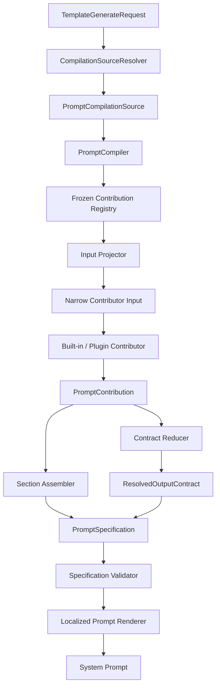

# Contract-first Prompt Specification Compiler 设计

## 1. 摘要

当前 `template_generator.py` 并不是调用 LLM 生成模板，而是把角色、背景、功能开关、工具、插件补丁和本地化文案编译成运行时 system prompt。本文建议将它重构为 Contract-first Prompt Specification Compiler。

该设计把 Prompt 看作确定性编译产物：

1. API 请求只表达用户选择的原始事实。
2. Resolver 解析资源并建立满足不变量的 Capability。
3. 内置能力和插件通过同一种 Contribution 机制参与编译。
4. Contribution 可以原子化贡献上下文 Section 和 `OutputContractPatch`。
5. Reducer 从唯一的基础 Output Contract 开始应用 Patch，得到唯一的结构化输出契约。
6. Assembler 生成完整 `PromptSpecification`。
7. Validator 校验输出契约、运行时能力和文档结构。
8. 纯 Renderer 将 Specification 渲染为最终 system prompt。

Output Contract 是“模型必须输出什么”的唯一事实源；完整 Prompt 的唯一事实源是 `PromptSpecification`。角色设定、背景资料和工具描述属于输入上下文，不被错误地塞入 Output Contract，但可以与相关 Contract Patch 由同一个 Contribution 原子化提供。

现有 `OutputFieldSpec`、`RequirementSpec`、`OutputContractPatch`、`ChatOutputContract` 和插件注册 API 保持兼容。现有 `TemplateGenerator.generate_chat_template()` 在迁移期间作为薄 Facade 保留。

## 2. 背景与现状

当前实现主要存在以下问题：

1. `TemplateGenerator.generate_chat_template()` 同时负责资源解析、字段定义、规则定义、背景资料、立绘资料、工具描述、插件补丁、本地化和最终字符串拼接。
2. `generate_chat_template()` 与 `render_dialog_reply_contract()` 重复维护 Output Contract 字段及 Requirement 逻辑。
3. `use_effect`、`use_cg`、`use_choice`、`use_stat` 等布尔参数与对应资源分别传递，可以表达矛盾状态。
4. 前端通过搜索“可用音效”“可调用工具”等自然语言锚点修改 system prompt。
5. `effectNames` 已作为结构化参数发送到后端，但模板生成入口没有完整消费它。
6. 模板生成依赖全局 `config_manager` 和全局语言状态，并可能在生成过程中保存配置。
7. Prompt 文本、Output Contract、插件扩展和运行时字段处理没有共享唯一的结构化事实源。
8. 插件 Patch 只按 `priority` 排序；相同优先级的冲突可能依赖插件加载顺序。

## 3. 第一性原则与不变量

### 3.1 编译链路

```text
TemplateGenerateRequest
    -> CompilationSourceResolver
    -> PromptCompilationSource
    -> Registered Contributions
    -> ResolvedOutputContract + Structured Sections
    -> PromptSpecification
    -> Validation
    -> Localized Renderer
    -> System Prompt
```

每一层只做一次语义转换。上游保留事实，下游消费已经验证的模型，不重新猜测上游意图。

### 3.2 必须成立的不变量

- Profile 只有一个来源。
- 同一能力不同时使用“启用开关”和“可用资源”作为两个事实源。
- 基础 Contract 只包含运行时不可取消的字段和要求。
- JSON 示例、字段说明和 Requirement 从同一个 `ResolvedOutputContract` 渲染。
- 内置能力与插件都不能直接修改最终字符串。
- 同一输入、同一 Registry 快照和同一本地化目录产生字节级稳定输出。
- Registry 在插件加载结束后冻结，单次编译期间不可变。
- 编译过程不读取或修改全局配置。
- Prompt 声明的内置运行时字段必须由运行时支持。

## 4. 目标与非目标

### 4.1 目标

- 内置能力与插件使用同一种 Contribution/Patch 机制。
- 新增普通能力时只需新增 Resolver、Contributor 和注册项，不修改 Compiler。
- Output Contract 成为输出格式和 Requirement 的唯一事实源。
- 相关上下文、输出字段和 Requirement 原子化出现或消失。
- 自由聊天和剧情模式共享 Contract Reducer、Validator 和 Renderer。
- 保持插件 Output Contract Patch API 兼容。
- 支持稳定排序、冲突检测、结构化错误和请求级本地化。

### 4.2 非目标

- 不修改 LLM 对话 JSON 的运行时解析协议。
- 不在第一阶段删除 `TemplateGenerator.generate_chat_template()` 公共入口。
- 不允许插件直接访问或修改最终 Prompt 字符串。
- 不把角色资料、世界观或工具说明伪装成 Output Contract 字段。
- 不自动为插件自定义字段创造运行时语义；插件需要声明它是 Prompt-only 数据或注册运行时能力。

## 5. 总体架构



Compiler 只负责编排，不认识 Effect、CG、Choice、Translation 等业务能力。所有业务差异通过已注册 Contribution 表达。

## 6. 请求事实与解析后的 Capability

### 6.1 原始请求

```python
@dataclass(frozen=True)
class TemplateGenerateRequest:
    profile: PromptProfileId
    character_names: tuple[str, ...]
    background_name: str | None
    effect_names: tuple[str, ...]
    enabled_features: frozenset[FeatureId]
    ui_language: str
    voice_language: str
    limits: PromptLimits
```

请求 DTO 不直接传给 Contributor。Resolver 负责规范化名称、读取 Repository、处理缺失资源和建立 Capability。

### 6.2 解析后的编译源

```python
@dataclass(frozen=True)
class PromptCompilationSource:
    profile: PromptProfile
    language: str
    voice_language: str
    characters: CharacterCapability
    background: BackgroundCapability | None
    effects: EffectCapability | None
    translation: TranslationCapability | None
    choice: ChoiceCapability | None
    narration: NarrationCapability | None
    stat: StatCapability | None
    cg: CgCapability | None
    cot: CotCapability | None
    tools: ToolCapability | None
    limits: PromptLimits
    plugin_contract_patches: tuple[OutputContractPatch, ...]
```

Capability 的存在表示该能力已启用且数据满足最低不变量：

```python
@dataclass(frozen=True)
class EffectCapability:
    effects: tuple[EffectConfig, ...]
    allow_unlisted: bool = False

    def __post_init__(self) -> None:
        if not self.effects and not self.allow_unlisted:
            raise ValueError("Effect capability requires effects or allow_unlisted")
```

Resolver 必须明确区分：

- 用户没有启用能力：Capability 为 `None`。
- 部分资源名称失效：记录结构化警告并使用剩余资源。
- 所有资源失效：根据 API 策略报错或显式降级，不能静默生成空能力。

Profile 只保存在 `PromptCompilationSource`，`compiler.compile(source)` 不再接收第二个 Profile 参数。

## 7. Prompt Specification

### 7.1 结构化 Section

```python
class PromptSectionKind(StrEnum):
    CAST_CONTEXT = "cast_context"
    WORLD_CONTEXT = "world_context"
    CAPABILITY = "capability"
    TOOL = "tool"
    CLOSING = "closing"


@dataclass(frozen=True)
class PromptSection:
    id: str
    kind: PromptSectionKind
    title_key: str | None
    body: PromptBody
```

`PromptBody` 可以是已转义文本，也可以是 Renderer 支持的结构化列表、键值表或资源列表。标题、本地化、空行和文档级格式由 Renderer 负责，Contributor 不把自然语言标题烘焙进大字符串。

### 7.2 内部唯一 Output Contract

公共 `ChatOutputContract` 不包含可 Patch 的 Requirement ID，因此编译过程使用内部结构化模型，并在边界适配回现有公共类型：

```python
@dataclass(frozen=True)
class ResolvedOutputContract:
    id: str
    fields: tuple[OutputFieldSpec, ...]
    requirements: tuple[RequirementSpec, ...]
    stream_mode: Literal["json_object", "json_lines", "json_array"]
    target_export: str
    protected_fields: frozenset[str]
```

它是以下内容的唯一来源：

- JSON 输出示例。
- Output field notes。
- Requirement 列表。
- JSON Schema。
- `ChatOutputContract` 适配结果。
- 运行时兼容性校验输入。

### 7.3 完整 Specification

```python
@dataclass(frozen=True)
class PromptSpecification:
    profile: PromptProfile
    sections: tuple[PromptSection, ...]
    output_contract: ResolvedOutputContract
    policies: PromptPolicies
```

Renderer 只消费 `PromptSpecification` 和请求级 Translator，不读取 Registry、Repository 或全局配置。

## 8. Contribution 模型

```python
@dataclass(frozen=True)
class PromptContribution:
    sections: tuple[PromptSection, ...] = ()
    contract_patch: OutputContractPatch | None = None
```

一个能力可以原子化贡献“模型需要知道什么”和“模型必须输出什么”。例如 Effect Contribution 同时提供可用 Effect 列表、`effect` 字段和 `r_effect` Requirement。Contribution 要么完整加入，要么不加入，避免三者漂移。

现有插件仍注册 `OutputContractPatch`。`PluginOutputContractPatchAdapter` 在编译边界将它包装成不包含 Section、`layer=PLUGIN` 的 Contribution，因此不要求插件迁移到新的内部 Registry API。

### 8.1 窄输入 Contributor

```python
InputT = TypeVar("InputT")


class PromptContributor(Protocol[InputT]):
    def contribute(self, data: InputT) -> PromptContribution | None:
        ...
```

Contributor 应是纯函数：

- 不读取全局 `config_manager`。
- 不保存系统配置。
- 不访问 Registry 或其他 Contribution。
- 不依赖最终 Prompt 的自然语言位置。
- 不直接渲染文档标题和全局空行。

## 9. 基础 Contract 与内置 Contribution

### 9.1 最小基础 Contract

基础 Contract 只包含运行时不可取消的不变量：

```python
BASE_DIALOG_CONTRACT_SPEC = BaseOutputContractSpec(
    id=DEFAULT_DIALOG_CONTRACT_ID,
    field_specs=(CHARACTER_NAME_FIELD, SPRITE_FIELD, SPEECH_FIELD),
    requirement_specs=(
        FORMAT_REQUIREMENT,
        CHARACTER_NAME_REQUIREMENT,
        SPRITE_REQUIREMENT,
        SPEECH_REQUIREMENT,
    ),
    protected_fields=frozenset({"character_name", "sprite", "speech"}),
    stream_mode="json_object",
    target_export="llm.output",
)
```

基础字段的形状是常量，但包含角色名称的文案不是全局常量。`BaseOutputContractFactory` 使用必需的 `CharacterCapability` 和请求级 Translator 将上述 Spec 实例化为初始 `ResolvedOutputContract`。它只填充基础不可变量，不包含 Effect、CG、Choice 等可选功能分支。

### 9.2 可选内置能力全部使用 Contribution

以下能力不再作为 Contract Builder 中的 `if` 分支：

```text
core.translation
core.effects
core.choice
core.narration
core.stat
core.cg
core.scene
core.bgm
core.cot
core.limits
```

以 Effect 为例：

```python
@dataclass(frozen=True)
class EffectPromptInput:
    capability: EffectCapability
    language: str


class EffectContributor:
    def __init__(self, translator_catalog: TemplateTranslatorCatalog) -> None:
        self._translator_catalog = translator_catalog

    def contribute(self, data: EffectPromptInput) -> PromptContribution:
        translator = self._translator_catalog.for_locale(data.language)
        return PromptContribution(
            sections=(
                PromptSection(
                    id="core.available_effects",
                    kind=PromptSectionKind.CAPABILITY,
                    title_key="available_effects",
                    body=EffectListBody(data.capability.effects),
                ),
            ),
            contract_patch=OutputContractPatch(
                id="core.effects",
                target_contract=DEFAULT_DIALOG_CONTRACT_ID,
                priority=170,
                add_fields=(
                    OutputFieldSpec(
                        key="effect",
                        type="string",
                        description=translator.text("template_gen.r_effect"),
                    ),
                ),
                add_requirements=(
                    RequirementSpec(
                        id="r_effect",
                        text=translator.text("template_gen.r_effect"),
                        order=170,
                    ),
                ),
            ),
        )
```

内置 Contributor 通过显式语言选择请求级 Translator，`OutputFieldSpec` 和 `RequirementSpec` 中保存确定的最终文本。公共插件仍可以提交已经渲染的文本，以保持兼容。Translator Catalog 是只读稳定服务，不能依赖全局 `current_language()`。

## 10. Registration、排序与 Profile

### 10.1 阶段

```python
class PromptPhase(IntEnum):
    OUTPUT_FORMAT = 100
    CAST_CONTEXT = 200
    WORLD_CONTEXT = 300
    CAPABILITIES = 400
    TOOLS = 500
    REQUIREMENTS = 600
    CLOSING = 900
```

阶段是稳定扩展槽；普通新功能应复用已有阶段。只有出现新的全局语义边界时才增加阶段。

```python
class ContributionLayer(IntEnum):
    BUILTIN = 100
    PLUGIN = 200
```

### 10.2 Profile Selector

共享 Contributor 默认适用于所有 Profile，不显式枚举 `free_chat`、`story`：

```python
@dataclass(frozen=True)
class ProfileSelector:
    include: frozenset[PromptProfileId] | None = None  # None means all
    exclude: frozenset[PromptProfileId] = frozenset()
```

Profile 由 `ProfileRegistry` 验证并可声明父 Profile 或 Capability 标签。Profile 专属 Contributor 使用显式 `include`。

### 10.3 失败策略

```python
class FailurePolicy(StrEnum):
    FAIL_FAST = "fail_fast"
    SKIP_WITH_WARNING = "skip_with_warning"
    USE_FALLBACK = "use_fallback"
```

```python
@dataclass(frozen=True)
class PromptRegistration(Generic[InputT]):
    id: str
    phase: PromptPhase
    priority: int
    profiles: ProfileSelector
    select_input: Callable[[PromptCompilationSource], InputT | None]
    contributor: PromptContributor[InputT]
    failure_policy: FailurePolicy = FailurePolicy.FAIL_FAST
    fallback: PromptContribution | None = None
    layer: ContributionLayer = ContributionLayer.BUILTIN
```

`select_input` 是 Composition Root 中的适配边界，只有它和 Compiler 可以看见完整 Source。Contributor 始终只接收窄输入。

Registration Validator 要求 `USE_FALLBACK` 必须提供 fallback，其他失败策略不得携带 fallback，避免再次产生组合状态歧义。

### 10.4 确定性排序和冻结

Registration 按以下键排序：

```python
(registration.layer, registration.phase, registration.priority, registration.id)
```

同一 ID 重复注册立即失败。Registry 在插件加载完成后冻结；Compiler 每次使用不可变 Registry 快照。

Built-in 和 Plugin 使用相同 Contribution、Reducer 和 Validator，但权限不同：

- Plugin Contribution 在 Built-in 之后应用，以保留插件覆盖核心描述的现有语义。
- Plugin 不能删除受保护字段。
- 新增重复字段必须报错；修改字段必须使用 `field_patches`。

## 11. Contract Reducer 与冲突规则

Reducer 从 `BaseOutputContractFactory` 创建的初始 Contract 开始：

1. 应用 Built-in Contribution Patch。
2. 应用 Plugin Patch。
3. 验证字段、Requirement 和运行时能力。
4. 生成不可变 `ResolvedOutputContract`。

Plugin Patch 也必须按稳定键排序：

```python
(patch.priority, patch.id)
```

冲突规则：

- Registration ID、Patch ID 和最终 Section ID 必须唯一。
- `target_contract` 不存在时产生结构化警告并跳过。
- `add_fields` 添加已有 key 时失败；覆盖必须使用 `field_patches`。
- `add_requirements` 添加已有 ID 时失败；覆盖必须使用 `requirement_patches`。
- Patch 指向不存在字段或 Requirement 时记录结构化警告。
- 插件不能删除 `protected_fields`。
- 最终字段保持基础字段顺序，再按 Contribution 排序追加。
- 最终 Requirement 按 `(order, id)` 排序。
- 相同优先级 Patch 通过 ID 获得稳定顺序，不能依赖插件加载顺序。
- 字段类型、必需字段、Schema 和流模式必须经过校验。

## 12. 运行时契约适配与校验

Prompt Contract 只声明输出格式，不自动创造运行时行为。但内置字段必须和运行时事实一致。

为避免破坏公共 `OutputFieldSpec`，运行时绑定保存在独立内部 Manifest：

```python
@dataclass(frozen=True)
class RuntimeFieldCapability:
    field_key: str
    accepted_types: frozenset[str]
    handler_id: str | None
    passthrough_allowed: bool = False
```

Validator 至少检查：

- `character_name`、`sprite`、`speech` 与 `LLMDialogMessage` 一致。
- 内置 `effect`、`translate` 等字段具有对应运行时能力。
- `stream_mode` 与实际 Parser 支持范围一致。
- Plugin 自定义字段可以通过新增的可选 companion API 注册 Runtime capability；未注册的现有插件字段按 Prompt-only passthrough 处理，以保持兼容并记录诊断信息。

最终 `ResolvedOutputContract` 通过 Adapter 转换成现有 `ChatOutputContract`，不修改现有公共 SDK 类型。可选 Runtime capability 注册是增量 API，不改变现有 `OutputContractPatch` 的构造和注册方式。

## 13. Assembler 与 Renderer

Assembler 收集 Contribution、验证 Section ID、调用 Contract Reducer，并生成 `PromptSpecification`。

Renderer 负责：

- 按已排序 Section 输出本地化标题和内容。
- 从 `ResolvedOutputContract` 生成 JSON 示例、字段说明和 Requirement。
- 统一空行、列表和转义规则。
- 保证 JSON 格式提醒位于结尾。
- 保证相同输入产生字节级稳定输出。

Translator 必须是请求级、locale-bound 的不可变对象：

```python
renderer = PromptRenderer(translator_catalog.for_locale(source.language))
```

禁止 Renderer 或 Contributor 调用全局 `current_language()` 决定请求语言。

## 14. 前后端边界

前端只发送结构化生成请求：

```json
{
  "profile": "free_chat",
  "characters": ["Mio", "Aoi"],
  "backgroundName": "Classroom",
  "effectNames": ["Rain", "Door"],
  "enabledFeatures": ["effect", "choice"],
  "uiLanguage": "zh_CN",
  "voiceLanguage": "ja"
}
```

后端生成完整 system prompt。前端不再搜索、删除或插入自然语言 Prompt 段落。

模板编辑器仍可允许用户手动修改生成后的 Prompt，但结构化参数变化后重新生成时，以后端输出为准。产品层应提示重新生成会覆盖手动编辑，或将手动内容保存为独立 User Override Section。

## 15. 错误处理与可观测性

稳定错误码至少包括：

```text
prompt.profile.unknown
prompt.capability.invalid
prompt.registry.frozen
prompt.contributor.duplicate_id
prompt.contributor.input_failed
prompt.contributor.contribute_failed
prompt.section.duplicate_id
prompt.contract.patch_duplicate_id
prompt.contract.patch_target_missing
prompt.contract.duplicate_field
prompt.contract.duplicate_requirement
prompt.contract.protected_field
prompt.contract.runtime_unsupported
prompt.contract.validation_failed
```

日志至少包含 `profile`、`contributor_id`、`layer`、`phase`、`priority`、`contract_patch_id`、`failure_policy` 和 `duration_ms`。

不得记录完整角色隐私内容或完整 system prompt，除非明确处于开发调试模式。任何失败都不能被静默吞掉。

## 16. 建议代码布局

```text
ai/llm/
├── template_generator.py          # 兼容 Facade
├── TEMPLATE_GENERATOR_DESIGN.md
└── prompt_compiler/
    ├── request.py                 # API 请求事实
    ├── capabilities.py            # 满足不变量的 Capability
    ├── models.py                  # Section、Contribution、Specification
    ├── profiles.py                # Profile Registry 与 Selector
    ├── registry.py                # Registration、排序与冻结
    ├── compiler.py                # 纯编排
    ├── contract.py                # Base Contract、Reducer、Adapter
    ├── runtime_contract.py        # 运行时能力 Manifest 与校验
    ├── renderer.py                # 请求级本地化渲染
    ├── resolvers.py               # Repository -> Capability
    └── contributors/
        ├── characters.py
        ├── sprites.py
        ├── background.py
        ├── effects.py
        ├── translation.py
        ├── tools.py
        ├── choices.py
        ├── stats.py
        └── closing.py
```

## 17. 渐进迁移方案

### 阶段 0：锁定完整行为

- 为自由聊天和剧情模式增加 golden/snapshot 测试。
- 覆盖背景、多角色、Effect、CG、Choice、Stat、Translation、CoT、限制参数和缺失资源。
- 覆盖插件字段、Requirement Patch、相同优先级和冲突场景。
- Golden 测试覆盖后端输出及当前前端字符串注入后的最终 Prompt。

### 阶段 1：建立唯一 ResolvedOutputContract

- 提取基础 Contract、Reducer、Validator 和 Renderer。
- 两个现有入口调用同一 Contract 流程。
- JSON 示例、字段说明和 Requirement 全部从同一 Contract 渲染。
- 保持公共函数签名和现有输出不变。

### 阶段 2：迁移内置可选能力

- 将 Translation、Effect、CG、Choice、Narration、Stat、CoT 和限制改造成 Built-in Contribution。
- 删除 Contract Builder 中对应的布尔条件分支。
- 每迁移一个能力，同时迁移 Section、字段和 Requirement。

### 阶段 3：引入 Capability Resolver 和结构化 Section

- API 请求解析为满足不变量的 Capability。
- 迁移 Character、Sprite、Background 和 Tools Section。
- 标题、本地化和空行转移到 Renderer。
- 旧入口把位置参数转换为 Request，再调用 Resolver 和 Compiler。

### 阶段 4：统一插件 Patch Reducer

- 插件与内置能力共享 Reducer、Validator 和稳定排序。
- 增加 Patch ID 唯一性和 `(priority, id)` 排序。
- 对依赖旧加载顺序的插件冲突提供诊断和迁移说明。

### 阶段 5：移除前端字符串注入

- 后端根据 `effectNames` 解析 `EffectCapability`。
- 删除前端对自然语言锚点的搜索及插入。
- 手动编辑改为显式 User Override Section 或清晰的覆盖提示。

### 阶段 6：统一剧情 Profile

- 剧情模式使用同一个 Compiler、Contract Reducer 和 Renderer。
- 剧情专属内容由 Profile 专属 Contributor 提供。
- 共享 Contributor 默认适用于所有 Profile。

### 阶段 7：清理全局依赖

- Resolver 显式注入 Config Repository、Tool Registry 和 Translator Catalog。
- 编译过程不保存 `voice_language` 或其他全局配置。
- API 层决定是否保存用户配置，Compiler 只消费请求快照。

## 18. 测试策略

### 18.1 Resolver 与 Capability

- 部分、全部资源名称失效时的行为。
- 不允许构造矛盾 Capability。
- Profile 只从一个来源解析。

### 18.2 Contributor

- Contributor 只使用窄输入。
- 相关 Section、字段和 Requirement 原子化出现。
- 不依赖全局配置或全局语言。

### 18.3 Registry

- Layer、阶段、优先级和 ID 排序。
- 重复 ID、Registry 冻结和 Profile Selector。
- 每一种 FailurePolicy。

### 18.4 Contract

- 基础受保护字段始终存在。
- Built-in Patch 在 Plugin Patch 前应用。
- Plugin Patch 按 `(priority, id)` 排序。
- 重复字段、Requirement 和未知目标诊断。
- JSON 示例、字段说明、Schema 和 Requirement 来自同一 Contract。
- Runtime Manifest 与内置字段一致。

### 18.5 集成与兼容

- 旧入口和新 Compiler 对相同输入生成相同 Prompt。
- `effectNames` 生成稳定 Effect Capability 和 Section。
- 自由聊天和剧情模式共享基础 Contract。
- 不同语言不依赖自然语言字符串定位 Section。
- 并发编译不同语言时互不影响。
- 相同输入、Registry 快照和语言目录产生字节级相同结果。

## 19. 验收标准

- `generate_chat_template()` 成为薄 Facade。
- 系统中只有一个 `ResolvedOutputContract` 构造、Patch、校验和渲染流程。
- JSON 示例、字段说明和 Requirement 不再重复维护。
- 基础 Contract 只包含不可取消字段和要求。
- 所有可选内置功能都通过 Built-in Contribution 注册。
- 内置和插件使用相同 Contribution、Reducer 和 Validator。
- Compiler 不包含 Effect、CG、Choice、Translation 等业务条件分支。
- 相关 Section、字段和 Requirement 原子化出现或消失。
- Contributor 只接收窄 DTO。
- Plugin Patch 具有稳定顺序和冲突诊断。
- 新增 Profile 不需要修改所有共享 Contributor。
- 公共类型和插件 API 不发生破坏性变化。
- Effect Prompt 完全由后端结构化生成。
- 编译过程不读写全局配置或全局 locale。
- 内置 Contract 字段通过运行时兼容性校验。
- 迁移前后的模板生成测试全部通过。

## 20. 被否决的方案

### 20.1 所有内容都塞入 OutputContract

角色资料、背景和工具是模型输入上下文，不是输出 Schema。最终设计使用 `PromptSpecification` 统一承载两者，但保持 Section 与 Output Contract 正交。

### 20.2 内置功能继续由 Builder 特判

如果内置能力仍由 Builder 中的 `if` 生成，而只有插件使用 Patch，新增能力仍需修改核心 Builder。所有可选内置能力必须使用 Built-in Contribution。

### 20.3 所有 Contributor 接收完整 Source

完整 Source 只暴露给 Composition Root 中的 Input Projector；Contributor 接收窄输入 Capability。

### 20.4 Contributor 直接修改共享字符串

这会产生顺序和自然语言锚点依赖，与当前前端字符串注入问题相同。

### 20.5 重新设计插件公共 API

现有 `OutputContractPatch` 已支持字段和 Requirement 扩展，因此使用内部 `ResolvedOutputContract` 和 Adapter，不修改公共 API。

## 21. 最终决策

采用 Contract-first Prompt Specification Compiler：

1. Request 只表达原始事实。
2. Resolver 将事实解析为满足不变量的 Capability。
3. 基础 Output Contract 只包含运行时不可取消字段。
4. 所有可选内置能力和插件都通过 Contribution 参与编译。
5. Contribution 原子化贡献 Context Section 和 `OutputContractPatch`。
6. Registry 通过 Layer、Phase、Priority 和 ID 提供稳定顺序，并在编译前冻结。
7. Contract Reducer 生成唯一 `ResolvedOutputContract`。
8. Validator 检查冲突、保护字段、Schema、流模式和运行时兼容性。
9. Assembler 生成唯一 `PromptSpecification`。
10. 请求级 Renderer 从 Specification 生成最终本地化 system prompt。
11. 现有公共类型、插件 Patch API 和 `TemplateGenerator` 入口通过 Adapter/Facade 保持兼容。

该结构使 Compiler 对新增普通能力关闭修改、对 Contribution 扩展开启，同时避免把 Output Contract 扩张成新的上帝对象。
