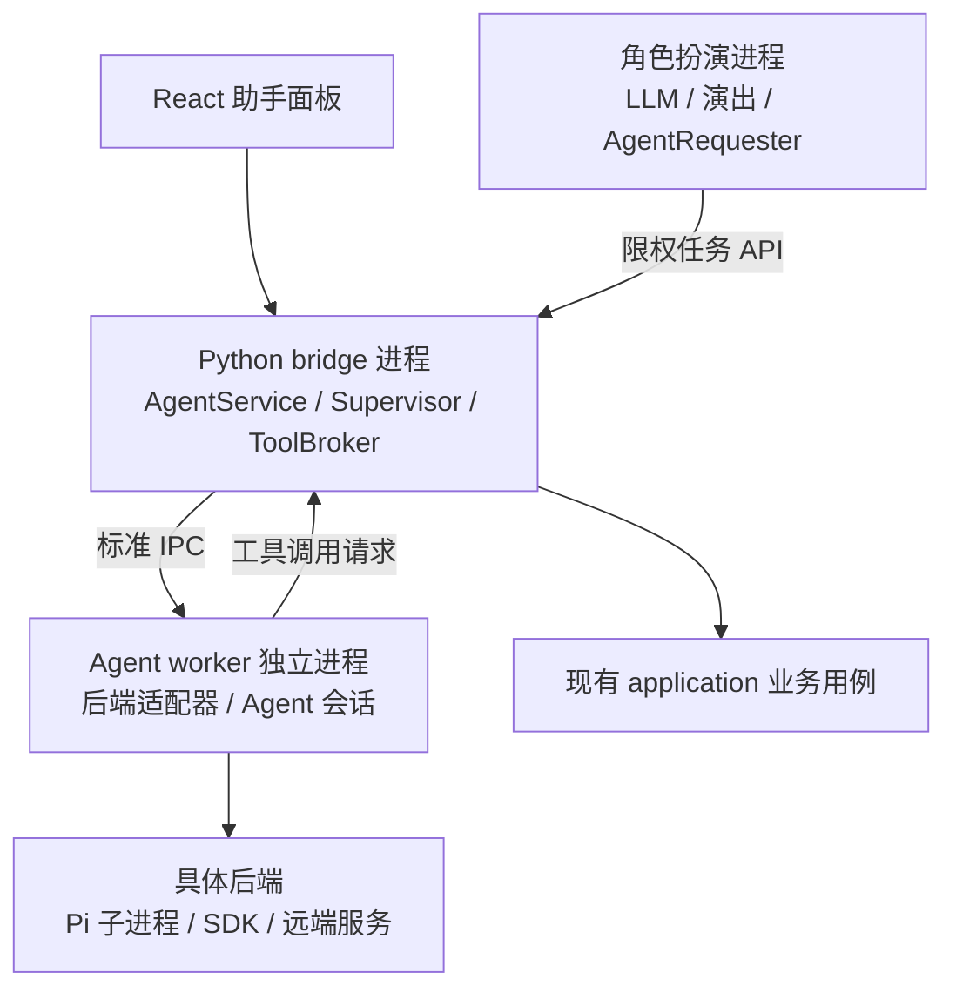
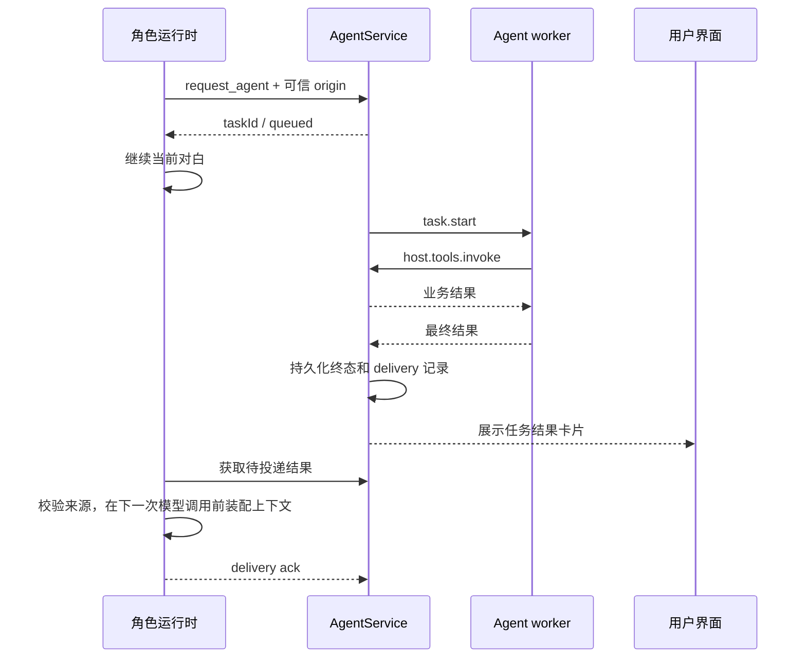

# Shinsekai 通用 Agent 系统设计

> 状态：阶段 A 已实现 SDK 公共契约、通用任务核心、持久化、IPC 和独立 mock worker；Pi 与产品入口待接入。
> 更新日期：2026-10-06。
> 范围：通用接口、独立进程、后端适配、宿主工具，以及角色扮演委托 Agent 的完整调用流程。
> 依赖边界遵循 [项目结构](PROJECT_STRUCTURE.md)。公共契约见 [sdk/agent.py](../sdk/agent.py)，任务核心用法见 [运行说明](AGENT_TASK_CORE_zh-CN.md)。HTTP、前端、Pi、业务工具和角色回传仍为实施目标。

## 1. 目标与设计决定

Shinsekai 提供一个独立的 Agent 助手，负责功能介绍、问题诊断、人物创建和插件开发。用户可以直接使用助手，角色扮演运行时也可以将明确的任务委托给它。首个后端采用 Pi，未来接入其他本地 CLI、SDK 或远端 Agent 时，前端和角色工具继续使用同一套接口。

本设计确定以下边界：

1. **Agent 必须在独立进程中运行。** Agent 循环、后端 SDK、后端扩展及其依赖不加载到 bridge 或角色扮演进程中。SDK 型后端也必须放进 worker；远端后端仍通过本地 worker 适配。
2. **Agent 与角色扮演拥有不同的会话、提示词、历史、模型配置和生命周期。** 角色扮演是 Agent 的一个调用方。关闭聊天不会关闭助手面板的任务，Agent 崩溃不会结束角色聊天。
3. **公共接口以 session、task、event、artifact 为中心。** Pi 的命令名、会话文件和事件类型止于 Pi adapter，不进入前端和角色工具契约。
4. **业务修改统一经过宿主工具。** Agent 通过明确接口请求角色保存、配置更新和插件安装；宿主复用现有 application 用例，负责校验、提交及界面通知。
5. **任务采用异步提交。** 提交成功只代表已受理；最终结果、取消结果和实际修改通过任务状态与事件报告。
6. **第一版按应用实例启动一个 worker，最多运行一个任务。** worker 一次绑定一个后端及版本。同一 session 的任务始终串行，不同调用方排队使用。worker 支持多个逻辑 session，不表示后端可以并发执行。

第一版不要求跨后端无损迁移内部历史，也不建立 Agent 之间的递归委托。角色扮演现有的对白、演出、TTS 和记忆管线继续由聊天运行时管理。

## 2. 当前代码中的接入依据

| 现有位置 | 可复用能力与接入约束 |
| --- | --- |
| [聊天进程管理](../application/chat/runtime_process.py) | 聊天已有独立进程；Agent 使用自己的 supervisor，不复用聊天进程句柄或启动参数 |
| [聊天运行时](../application/chat/session_runtime.py) | 负责角色聊天生命周期；这里只装配 Agent 请求端口 |
| [LLM 宿主接口](../sdk/llm_runtime.py) 与 [宿主实现](../application/runtime/context.py) | AI 工具通过窄接口访问 application；Agent 委托沿用该依赖方向 |
| [工具执行器](../ai/tools/tool_executor.py) | 当前角色工具同步等待并有超时；委托工具仅等待短暂的提交回执，不等待整个 Agent 任务 |
| [角色用例](../application/characters/management.py) | Agent 创建和修改人物的统一业务入口 |
| [日志诊断](../application/diagnostics/logs.py) 与 [日志脱敏](../sdk/logging/redaction.py) | 复用日志定位及脱敏能力；工具返回前仍需对实际输出脱敏，不能假设历史日志都已经处理 |
| [插件脚手架](../sdk/cli/scaffold.py) 与 [开发规范](PLUGIN_DEVELOPER_GUIDE.md) | 插件创作的模板与宿主契约 |
| [聊天分支](../application/chat/manage_branches.py) 与 [回合协调](../core/messaging/chat_turn_service.py) | 回传前校验分支和请求来源，在下一次模型调用前装配结果 |
| [bridge 鉴权](../frontend_bridge_core/routes/http_handler.py) | 复用用户界面访问鉴权；角色进程另发限权凭据 |

现有 [后台任务表](../application/runtime/tasks.py) 是进程内字典，适合当前短期后台操作。Agent 需要持久化会话、增量事件与结果回传，因此建立独立任务存储；通用任务面板可以展示其摘要，但不能形成两个状态所有者。

## 3. 进程与职责



这些名称表示职责，首版无需拆成额外服务：

- **AgentService**：运行在 bridge 进程中的 application 层，拥有会话、队列、任务状态、事件存储和调用方身份。所有入口都调用它。
- **AgentSupervisor**：由 AgentService 持有，负责 worker 的启动、握手、健康状态、取消升级和退出清理。进程实现放在 application，不放进 HTTP 路由。
- **Agent worker**：负责协议适配、后端会话、模型运行、事件标准化。它通过 IPC 请求宿主工具，不持有 `BridgeState`、角色 manager 或聊天 `AppRuntime`。
- **Backend adapter**：在 worker 内实现统一后端接口。Pi adapter 启动官方 binary；SDK adapter 在 worker 内加载 SDK；其他语言的 worker 可以直接实现相同 IPC。
- **ToolBroker**：位于 application 层，按任务上下文检查工具请求，调用具体业务用例，并返回结构化结果。

Pi 方案会有 worker 和 Pi 两个子进程。worker 负责将 Shinsekai 协议与 Pi 原生 RPC 转换，二者不是同一套协议。后续若某个可执行后端原生实现 Shinsekai IPC，可以直接成为 worker。

进程隔离用于依赖隔离、故障隔离与生命周期管理。文件和执行权限由工具实现及运行环境约束；进程拥有自己的工作目录不等于获得了操作系统沙箱。

## 4. 稳定的数据模型

公共 JSON 使用 camelCase，Python 内部类型使用 snake_case。边界负责转换。ID 均由宿主分配，时间使用 UTC ISO 8601，展示层转换为用户时区。

| 对象 | 核心字段 | 所有者 |
| --- | --- | --- |
| `AgentSession` | `sessionId`、`backendId`、`backendVersion`、`profileId`、`modelRef`、`owner`、`createdAt` | AgentService；一个 session 固定一个后端及配置快照 |
| `AgentTask` | `taskId`、`sessionId`、`requestId`、`origin`、`input`、`context`、`limits`、`status`、`attemptId` | AgentService；一次明确目标的执行 |
| `AgentEvent` | `schemaVersion`、`taskId`、`eventSeq`、`type`、`timestamp`、`payload` | AgentService 持久化后发布 |
| `AgentResult` | `summary`、`data`、`artifacts`、`evidence`、`effects`、`warnings` | adapter 提供候选输出，宿主校验并补入真实操作记录 |
| `AgentArtifact` | `artifactId`、`kind`、`title`、`mimeType`、`size`、`revision` | 宿主管理；内容通过授权资源接口读取 |
| `AgentOrigin` | `kind`、`callerId`、`conversationId`、`branchId`、`chatInstanceId`、`sourceTurnId`、`contextEpoch` | 可信调用端与宿主装配；不是模型可填写的授权信息 |

`backendId`、`profileId` 是开放字符串，通过注册表解析。公共代码按能力工作，不写 `if backend == "pi"`。`modelRef` 引用宿主保存的模型配置，API Key 不进入提示词、事件或任务 JSON。

`sessionId` 是 Agent 会话标识，不能使用角色聊天的 session ID 代替。助手面板可以多轮复用会话；首版每次角色委托新建一个 Agent session，后续查询同一个 task。这样多角色或不同聊天分支不会意外共享 Agent 上下文。

`AgentContext` 只允许结构化条目：`text`、`resourceRef`、`artifactRef`，每项带 `source` 和明确的用途。资源引用由宿主解析，不能把任意本机路径当作已有访问授权。角色委托默认只传任务相关的用户要求、选定人物摘要和资源引用。

以下示例是**经过宿主装配后的任务**，不是全部暴露给模型的工具参数：

```json
{
  "requestId": "req_01",
  "sessionId": "as_01",
  "input": {"text": "检查当前语音服务为什么连接失败，给出诊断结果。"},
  "context": [{"kind": "resourceRef", "ref": "diagnostics:tts", "source": "host"}],
  "origin": {
    "kind": "roleplay",
    "callerId": "chat-runtime-01",
    "conversationId": "chat-01",
    "branchId": "branch-01",
    "chatInstanceId": "runtime-instance-01",
    "sourceTurnId": "turn-18",
    "contextEpoch": 4
  },
  "limits": {"wallTimeMs": 120000, "maxToolCalls": 20},
  "lifetime": "origin-bound"
}
```

`limits` 由宿主按 profile 设置并在执行时检查。模型上下文、token 用量和费用由后端报告；不能精确测量的值为 `null`，不承诺严格费用上限。所有工具调用，包括后端原生工具，都必须纳入可用的计数与取消机制。

## 5. 面向调用方的通用接口

AgentService 提供以下用例。React、角色请求端口和未来插件均调用这些契约，不能直接驱动某个后端进程。

| 操作 | 输入 | 输出与语义 |
| --- | --- | --- |
| `list_backends` | 调用方上下文 | 后端描述、安装状态、能力与不可用原因 |
| `create_session` | 后端、profile、model 引用 | `AgentSession`；角色入口由宿主选择这些配置 |
| `submit_task` | session、请求内容、`requestId` | `TaskReceipt`，持久化排队成功后返回 |
| `list_tasks` | session、状态筛选、分页游标 | 当前调用方可见的任务摘要 |
| `get_task` | `taskId` | 当前状态、最终结果或结构化错误 |
| `read_events` | `taskId`、`afterSeq`、`limit` | 可重放的增量事件与下一游标 |
| `cancel_task` | `taskId`、原因 | 当前状态与取消请求是否接受 |
| `respond_input` | `taskId`、`inputRequestId`、回答 | 消费指定的待答请求；重复相同回答幂等 |
| `read_artifact` | `artifactId`、revision | 授权后的内容或下载句柄 |
| `detach_task` | `taskId` | 用户接管角色委托；原来源保留，停止向角色自动投递 |
| `close_session` | `sessionId` | 活跃任务返回 `SESSION_BUSY`；先取消并等任务结束再关闭 |

`requestId` 在调用方命名空间内去重。同一 ID 和相同请求返回原 `taskId`；同一 ID 携带不同内容返回 `IDEMPOTENCY_CONFLICT`。提交连接断开后，重试不得重复创建人物或执行插件安装。

用户界面通过 `/api/agent/` 下的 HTTP API 使用这些用例：

```text
GET  /api/agent/backends
GET  /api/agent/sessions
POST /api/agent/sessions
POST /api/agent/sessions/{sessionId}/tasks
POST /api/agent/sessions/{sessionId}/close
GET  /api/agent/tasks
GET  /api/agent/tasks/{taskId}
GET  /api/agent/tasks/{taskId}/events?afterSeq=0&limit=100
POST /api/agent/tasks/{taskId}/cancel
POST /api/agent/tasks/{taskId}/input
POST /api/agent/tasks/{taskId}/detach
GET  /api/agent/artifacts/{artifactId}
```

首版事件通过有游标的短轮询获取；任务运行时前端刷新增量文本、工具活动和状态，终态后停止轮询。以后增加 WebSocket 推送只改变传输方式，仍使用相同事件和重放接口。

角色进程使用独立的 `/api/agent/delegations` 提交入口，并复用限权的任务查询、取消及事件接口。其凭据绑定当前聊天实例与允许的 profile，不能用于创建任意会话、切换后端、扩大权限或读取助手面板的其他任务。桌面完整 bridge token 不传给模型，也不作为角色委托凭据。

角色传输端另有内部 `read_deliveries`、`ack_delivery` 和 `invalidate_origin` 用例，分别对应 `GET /api/agent/delegations/deliveries`、`POST /api/agent/delegations/deliveries/{deliveryId}/ack`、`POST /api/agent/delegations/invalidate`。这些操作只作用于凭据绑定的聊天实例，不注册成 LLM 工具。上下文失效时本地先停止接收旧结果，再通知宿主撤销投递和取消任务；即使通知失败，本地仍拒绝旧结果。

## 6. worker IPC 与后端适配契约

### 6.1 宿主与 worker 的进程协议

使用私有 stdin/stdout 管道传输 UTF-8 JSONL，信封采用 JSON-RPC 2.0。stdout 专用于协议，stderr 用于诊断日志。宿主与 worker 都可以发请求，RPC ID 带方向前缀，避免宿主工具反向调用时冲突。

| 方向 | 方法 | 用途 |
| --- | --- | --- |
| 宿主 → worker | `worker.initialize` | 协商协议版本、后端版本、能力、资源目录及配置 |
| 宿主 → worker | `worker.ping` / `worker.shutdown` | 心跳与受控退出 |
| 宿主 → worker | `session.open` / `session.close` | 创建或恢复绑定的后端 session |
| 宿主 → worker | `task.start` | 启动已持久化的任务；响应只表示接受执行 |
| 宿主 → worker | `task.cancel` / `task.respond` | 取消执行或补充指定问题的回答 |
| worker → 宿主 | `task.event`（通知） | 输出标准事件，带 `attemptId` 与单调递增的 `workerSeq` |
| worker → 宿主 | `host.tools.invoke` | 调用当前任务允许的宿主工具 |
| worker → 宿主 | `host.input.request` | 请求补充信息，返回与 `inputRequestId` 关联的回答 |

握手独立协商 `protocolVersion` 和 `eventSchemaVersion`；大版本不匹配时在执行前报错，小版本只增加可选字段。未知事件可以跳过并记录，未知状态、必需能力或方法不能被解释成成功。

协议读取循环必须持续工作，不能被 `task.start`、模型生成或待答请求阻塞，否则取消和工具回调会死锁。工具调用在独立的异步任务中处理，不持有全局队列锁或业务锁等待模型。

单条消息初始限制为 1 MiB，大文件使用 artifact 引用。输出队列必须有界；文本增量允许合并，工具结果、输入请求和终态不得丢弃。超大帧、非法 JSON 或协议污染使该 worker 不可用，并明确结束受影响任务。

### 6.2 后端接口

下列 Python 伪代码定义语义；实际跨进程兼容以 JSON 契约为准，后端可以用其他语言实现：

```python
class AgentBackend(Protocol):
    async def initialize(self, config: BackendConfig) -> BackendDescriptor: ...
    async def open_session(self, config: SessionConfig) -> BackendSessionHandle: ...
    def run(
        self,
        session: BackendSessionHandle,
        task: TaskExecution,
        host: AgentHostPort,
    ) -> AsyncIterator[BackendEvent]: ...
    async def cancel(self, attempt_id: str) -> None: ...
    async def respond(self, input_request_id: str, answer: InputAnswer) -> None: ...
    async def close_session(self, session: BackendSessionHandle) -> None: ...
    async def shutdown(self) -> None: ...


class AgentHostPort(Protocol):
    async def invoke_tool(self, request: HostToolCall) -> HostToolResult: ...
    async def request_input(self, request: InputRequest) -> InputAnswer: ...
```

`BackendSessionHandle` 是不透明值，仅在 adapter 内解释。`AgentHostPort` 是当前任务的窄回调端口，不暴露 manager 或 bridge 对象。普通异常在 worker 边界转换为标准错误，不能将 SDK 异常类型或原生堆栈变成公共 API。worker 重启后无法原生恢复的 session 返回 `SESSION_RESUME_UNAVAILABLE`，由宿主提供创建交接会话的入口，不静默丢弃历史继续运行。

后端描述包括 `backendId`、`version`、`capabilities`、`availability`，能力至少覆盖：

| 能力 | 处理规则 |
| --- | --- |
| `hostTools` | 新世界业务 profile 的必需能力；后端能把自定义工具调用交还宿主执行 |
| `toolPolicyEnforcement` | 能关闭未允许的原生工具并控制原生工具范围；达不到时不启用需要该约束的 profile |
| `streamingText` | 可选；不支持时发送完整消息事件 |
| `nativeSessionResume` | 可选；不支持时可用宿主整理的交接内容创建新会话 |
| `interactiveInput` | 可选；不支持时需在提交前收齐输入，或明确返回能力不支持 |
| `structuredOutput` | 可选；缺失时保留文本结果，宿主从工具结果提取可靠的结构化数据 |
| `usageReporting` / `tokenLimit` | 分别描述用量报告与 token 限额能力，不能混为同一保证 |

每个受支持后端都必须有可靠的结束判定和终止办法。即使没有原生取消 API，也必须能关闭其独占执行进程；如果远端执行无法确认停止，结果为 `interrupted` 并标注执行状态未知，不能报告已取消。

能力声明需要 adapter 契约测试验证。无法满足所选 profile 时返回 `CAPABILITY_UNSUPPORTED`，不悄悄切成可任意执行命令的模式。

### 6.3 Pi 作为第一个 adapter

Pi adapter 负责 binary 定位、启动原生 RPC、独立配置目录、会话映射、扩展加载以及事件转换。新世界宿主工具由一个随应用发布的 Pi extension 注册；extension 通过 adapter 管理的私有本机工具通道转发请求，adapter 再调用 `AgentHostPort`。该通道使用每次运行生成的凭据和任务绑定，不复用用户界面的完整 bridge 权限。

Pi 的请求受理、单轮结束和整个运行稳定结束可能是不同事件。adapter 必须按锁定版本的协议确认任务真正结束，才能产出标准终态。原生事件名只出现在 Pi adapter 和其测试中。

替换 Pi 时，仅替换后端注册、worker/adapter 实现与运行资源清单。AgentService、前端事件处理、角色委托工具和宿主业务工具均保持相同契约。

## 7. 任务状态、事件与恢复

```text
queued → running ⇄ waiting_input
   │        │           │
   └────────┴───────────┴→ cancelling → cancelled
            │
            ├→ succeeded
            ├→ failed
            └→ interrupted
```

`queued` 也可以因取消直接进入 `cancelled`，因启动或能力检查失败进入 `failed`。`waiting_input` 可以超时失败。worker 丢失时，`running`、`waiting_input`、`cancelling` 均可进入 `interrupted`。后四个终态为 `succeeded`、`failed`、`cancelled`、`interrupted`，终态不可再次运行。

- `succeeded`：本次执行正常结束且结果通过宿主格式检查；结果是否解决用户问题仍需由证据说明。
- `failed`：已知错误或限制使任务结束，包含机器可读错误码。
- `cancelled`：执行已停止，未开始的工具被禁止，已开始的操作已完成核对。
- `interrupted`：进程或通信故障导致执行无法完整确认。保留已知结果与 `unknown` 操作记录，不自动重放任务。

标准事件采用有限的类型集合：

```text
task.status
message.delta / message.completed
tool.started / tool.completed
input.requested / input.resolved
artifact.created
usage.updated
task.completed
```

`task.completed` 包含唯一终态、结果和错误，是 UI 停止等待的依据。`message.completed` 是完整消息正文，覆盖拼接的增量文本；进度和消息更新均不能代表任务完成。不要求后端暴露内部思维链，前端展示工作说明、工具活动和可验证结果。

宿主把状态快照、事件和最终结果在同一 SQLite 事务中提交，再向调用方发布。`eventSeq` 在单个 task 内单调递增。worker 的 `(attemptId, workerSeq)` 用于去重，调用方只认识宿主分配的 `eventSeq`。首版保留会话全部事件，清理整个会话时一并清理，避免游标过期的额外语义。

取消是幂等命令。宿主先设置 `cancelling` 并拒绝新的写工具，再请求后端中止；超时后终止专属执行进程。已在提交中的业务操作先完成状态核对，无法确认的标记为 `unknown` 并进入 `interrupted`。取消不表示撤销已生效的修改。

完成与取消的竞争由宿主串行裁决：已提交终态后取消返回现状；取消已接受后不能再把普通完成通知写成 `succeeded`。每个终态仍保留截至收尾时已生效的操作记录。

应用重启后恢复任务、结果和事件；此前未收尾的运行任务标记 `interrupted`，排队任务保留但不自动启动。用户继续工作时创建新任务，并明确引用上一次的已知结果。协议握手和只读探测可以重试，包含写操作的任务不因 worker 重启自动重试。

标准错误码包括 `BACKEND_UNAVAILABLE`、`CAPABILITY_UNSUPPORTED`、`AUTH_REQUIRED`、`INVALID_REQUEST`、`SESSION_BUSY`、`IDEMPOTENCY_CONFLICT`、`TOOL_DENIED`、`INPUT_EXPIRED`、`LIMIT_EXCEEDED`、`WORKER_LOST`、`PROTOCOL_MISMATCH`。错误可带 `retryable` 提示，但重试仍需遵守操作幂等性。

调度采用有界 FIFO 队列；profile 限制单个调用方的排队数，防止角色反复委托占满队列。`waiting_input` 在首版仍占用执行槽，UI 显示正在等待哪个任务，允许用户取消或回答；不隐藏这一限制。输入等待有独立期限，墙钟总时限包含等待时间。

## 8. 宿主工具、skills 与系统行为

工具定义包含 `name`、`description`、`inputSchema`、`outputSchema`、`effectKind` 和所需 capability。执行结果包含 `ok`、`data`、`error`、`artifactRefs` 及操作记录。profile 决定可用工具集合，skills 不授予权限。

第一批工具围绕业务能力设计：

| 工具组 | 拟提供能力 | 主要复用位置 |
| --- | --- | --- |
| `help.*` | 搜索随版本发布的功能文档、读取当前能力、请求打开页面 | 文档资源与前端导航事件 |
| `diagnostics.*` | 读取脱敏日志、获取环境摘要、测试服务连接 | `application/diagnostics/` 与现有配置探测 |
| `characters.*` | 查询、校验、保存人物，调用已配置的资源生成流程 | `CharacterUseCase` 与人物生成用例 |
| `plugins.*` | 创建脚手架、校验工程、检查依赖、提交安装请求 | `sdk/cli/` 与 `application/plugins/` |
| `workspace.*` | 在任务工作目录中读写文件、生成 diff、执行必要检查 | 独立的工作目录与执行端口 |

宿主工具根据任务绑定的身份、profile 和资源范围授权，不接受模型自行填写的权限或“用户已同意”字符串。需要用户回答或确认的动作使用带 `inputRequestId` 的请求；由真实界面用户解决，角色模型不能替用户扩大权限。已有配置明确授权的操作可直接执行。

人物和配置修改携带读取时的 revision，提交时检查冲突；宿主读取最新数据后调用已有用例，成功后通知相关页面重新获取数据。首版用应用层串行锁与版本比较实现，不要求更换现有配置存储。已经启动的角色会话按原有快照规则处理，Agent 不能绕过会话重配置流程直接改内存对象。

写工具携带稳定的 `callId`，宿主记录执行状态。重复调用返回已记录结果；相同 `callId` 的不同参数报错。若落盘与记录之间崩溃，恢复时通过资源 revision/结果标识核对；无法核对时保留 `unknown`，不声称跨文件事务具备 exactly-once 保证。

插件文件先写入 Agent workspace，执行检查后再通过安装用例提交。插件校验不得通过在 bridge 内直接 import 新生成的代码完成。现有插件启用后的宿主进程执行方式由插件系统管理。

skills 随应用发布在 `assets/agent/skills/`，首版包括功能介绍、诊断、人物创建和插件开发。宿主保存统一的 skill 内容与版本，adapter 负责转换成后端支持的资源形式；不支持自动 skill 发现的后端，由宿主按 profile 显式提供所需流程。工具名称与 schema 是最终事实来源。

理性与独立判断写入始终生效的 Agent 系统策略：区分事实、假设和建议；依据工具结果声明操作完成；证据不足时说明不确定；发现用户前提不成立时明确指出；失败后不得伪造已完成。角色性格、剧情规则和台词格式不进入这份策略。角色摘要和外部文档作为任务数据传入，不提升为系统指令。

## 9. 角色扮演如何请求 Agent

### 9.1 模型看到的工具

角色 LLM 只看到窄接口：

```python
def request_agent(task: str, context_refs: list[str] | None = None) -> TaskReceipt: ...
def get_agent_task(task_id: str) -> TaskSnapshot: ...
def cancel_agent_task(task_id: str) -> TaskSnapshot: ...
```

工具实现将放在 `ai/tools/agent_tools.py`，通过已实现的 `sdk/agent.py` 中 `AgentRequester` 契约调用宿主。`sdk/llm_runtime.py` 已暴露该窄端口，由 application 装配实现；不可从 `ai/tools` 导入 application 或 bridge。未启用 Agent 时返回 `BACKEND_UNAVAILABLE`，角色正常继续聊天。

模型不能指定 `backendId`、模型 Key、工具权限、任意文件路径或其他聊天的 `sessionId`。请求端根据真实聊天上下文附加 origin、profile、预算和可用资源。`context_refs` 必须来自宿主提供的资源清单。

提交回执示例：

```json
{"taskId":"at_01","status":"queued","message":"任务已交给新世界助手。"}
```

角色可以据此说明“已经请助手检查”，只有最终工具结果才能支撑“问题已经修复”。不得把 `queued` 解释为完成，也不得在同一模型回合反复调用查询工具忙轮询。

### 9.2 异步回传



角色运行时通过注入的 completion inbox 端口获取结果，具体 HTTP/轮询适配放在 bridge transport 层，由启动组合根注入。第一版后台监视器低频查询未完成委托，停止聊天时停止查询。业务 application 代码不依赖具体 HTTP 实现。

回传采用以下规则：

1. Agent 全量轨迹保存在自己的 session；角色只接收结果摘要、结构化数据、证据和必要的 artifact 引用。
2. UI 先展示独立的 Agent 任务卡片；Agent 的流式文本不直接进入角色对白、TTS 或立绘输出。
3. 结果作为带来源的外部任务结果，在下一次角色模型调用前加入上下文。不能伪装成用户消息，不能追加一个没有对应 tool call 的悬空 `tool` 消息。由现有模型消息适配层生成合法结构。
4. 首版不因任务完成自动制造一个角色回合；用户下一次对话时角色可使用结果，用户也可在结果卡片选择“让角色解释”。该动作作为明确的用户交互进入现有回合调度。
5. `deliveryId` 由 task、终态版本和目标聊天组成。角色运行时先持久化 inbox 再发接收 ack，重连可重复拉取。消费时将结果与 `deliveryId` 写成同一条宿主历史记录并原子保存；该记录是消费事实来源，独立 inbox 标记可以据此重建。模型消息适配器移除宿主元数据，避免向供应商发送非法字段。不能通过先标记已消费、后写聊天历史的两个独立步骤保证一致性。

Agent 结果是否投递，必须同时检查 `conversationId`、`branchId`、`chatInstanceId`、`contextEpoch` 以及来源用户回合是否仍在当前历史中。现有 `TurnHandle.id` 仅在进程内有效，实施时需要在聊天委托适配层补充稳定的 `sourceTurnId`；不能直接用列表下标作为持久身份。

`contextEpoch` 是拟新增的委托上下文代数，在回档、重抽、清空历史、切换分支、分叉及聊天重配置时递增；普通后续用户消息不递增。聊天进程重启会更换 `chatInstanceId`。这些操作在使旧上下文失效的同一个协调步骤中撤销待投递结果。

首版角色任务默认 `origin-bound`：中断来源回合、上述历史变更或聊天关闭时请求取消；已经完成的结果仍可在助手任务列表查看，但不会注入其他分支。普通新回合到来时，若来源回合已经正常完成，任务可以继续。

用户可以在助手面板显式接管任务为 `detached`，任务随后不受聊天生命周期影响；它保留原始来源用于追溯，后续结果只回到助手面板，除非用户再次选择发送给角色。角色模型本身不能把任务改成 detached。

Agent 的工具集合不包含 `request_agent`，也不允许主动命令角色继续调用 Agent，从而避免循环委托。用户与角色都能查看同一任务，但 Agent 的补充问题和真实操作确认由用户界面承接。

## 10. 运行资源、配置与持久化

建议存储结构如下，根目录通过现有数据目录解析规则获取，不依赖安装目录可写：

```text
data/
  config/agent.yaml                    # 启用状态、后端、模型引用、profile 和默认限额
  agent/
    agent.sqlite                      # sessions / tasks / events / deliveries / tool_calls
    runtimes/<backendId>/<version>/    # 下载并校验后的运行包
    backend-state/<backendId>/         # 仅 adapter 解释的原生 session / 配置
    workspaces/<sessionId>/            # 插件创作等可编辑工作目录
    artifacts/<artifactId>/            # diff、诊断报告和生成文件
```

AgentService 是 `agent.sqlite` 的唯一写入者；角色自己的 inbox 接收记录与聊天历史一起持久化。原生后端历史由 adapter 管理，不作为公共接口或角色历史的事实来源。

应用发布目录中的 `assets/agent/` 存放系统策略、skills、选定的用户文档和 SDK 参考。当前桌面资源打包会包含 `assets/`，不会自动包含整个 `docs/`；实现时需要显式准备与应用版本一致的 Agent 文档包，并校验其引用。

首次启用所选后端时，按已锁定版本的平台清单下载安装、校验 hash、原子切换到就绪状态；失败保留可重试状态，不阻断普通角色聊天。清单包含平台、架构、版本、下载地址、hash 和 adapter 协议兼容范围。可以导入同版本的本地运行包。运行中的 session 不自动切换 binary 版本。

Agent 模型配置独立，可以引用现有 API 配置作为初始值；创建 session 时固定模型、profile、系统策略和 skill 版本快照，之后的配置修改应用于新 session。凭据更新不改变模型语义，可以在下一次调用前重新解析。adapter 负责供应商协议转换，无法适配时报告不可用。凭据通过私有启动通道或受限文件提供，不通过命令行参数、技能文本或事件传递。

worker 按需启动，在应用退出时先停止接收任务、处理取消，再退出进程树。Windows 后台启动不弹控制台窗口；由进程树管理确保 worker/Pi 在宿主退出后清理。关闭助手面板只断开 UI 订阅。第一版不提供应用退出后的后台执行。

首版应用一次启用一个后端及版本。切换前必须处理完或取消非终态任务，再退出旧 worker、启动新 worker 并创建新 Agent session；不把已经排队的任务转给另一个后端。请求运行与当前 worker 绑定不一致的旧 session 时，返回 `SESSION_BACKEND_MISMATCH` 并提供切回对应后端的入口。

需要继续旧工作时，使用标准结果、artifact、未解决问题及已执行操作清单形成交接内容；不能把 Pi 原生 JSONL 填给另一个后端并宣称无损恢复。旧 session 保留后端版本绑定，其历史仍可查看。下载管理、后端切换和恢复队列由用户配置用例调用 `prepare_runtime`、`activate_backend`、`resume_queue`，不暴露给角色模型；恢复队列前重新验证 origin 和 session 绑定。

## 11. 拟议代码布局与依赖

```text
sdk/
  agent.py                            # 共享值类型、AgentRequester、AgentBackend、AgentHostPort
application/agent/
  management.py                       # AgentService 唯一稳定用例入口
  supervise_worker.py                 # worker 生命周期、队列执行与进程树清理
  worker.py                           # Python worker 组合入口，可替换为其他语言 worker
  submit_task.py / cancel_task.py
  execute_host_tool.py                 # ToolBroker 与业务用例装配
  deliver_results.py                  # 角色委托投递与去重策略
  prepare_runtime.py                  # 下载、校验与版本选择编排
application/chat/
  delegate_agent.py                   # 聊天 origin、取消绑定、结果 inbox 与回合装配
ai/agent/
  backends/pi/                       # Pi RPC、资源转换、宿主工具 extension
  backends/mock.py                   # 已实现：无外部模型的契约验证后端
core/agent/
  ipc.py                             # JSONL 编解码、相关 ID 与消息边界
  storage.py                         # SQLite 读写、事务和 schema 迁移
config/
  agent.py                           # Agent 配置 schema、默认值与读写
frontend_bridge_core/
  routes/agent_routes.py              # HTTP 鉴权和 DTO 投影
  transport/agent_client.py           # 角色进程的限权客户端与结果查询适配
ai/tools/
  agent_tools.py                     # 角色可调用的三个窄工具
frontend/src/
  entities/agent/                    # 公共 DTO、API repository 和事件归并
  features/agent-assistant/           # 助手会话、任务、工具活动与 artifact UI
assets/agent/
  system.md / skills/ / references/
```

`core/agent/` 提供无应用全局状态的协议和存储能力，任务状态转换、当前运行任务和业务调度属于 application。`ai/agent/` 只能依赖 SDK 窄端口及下层能力，不得导入 application 或 bridge。后端注册表由 worker 组合入口构建，bridge 读取静态后端描述时不导入后端 SDK。

第一版后端由应用内显式注册，暂不建立任意第三方后端插件发现机制。后续开放时仍以 worker 启动描述和能力契约注册，不能通过在 bridge 内加载插件来破坏进程边界。

## 12. 实施顺序与验收

| 阶段 | 交付 | 退出条件 |
| --- | --- | --- |
| A：通用任务核心 | DTO、AgentService、持久化、IPC、mock worker | 无 Pi 依赖即可完成提交、事件、取消、崩溃恢复与幂等测试 |
| B：Pi 接入 | 版本管理、adapter、宿主工具回调、独立 session | binary 实际运行通过协议和工具测试；Pi 类型不泄漏到公共 API |
| C：直接助手 | React 面板、介绍/诊断/人物工具与 skills | 用户可独立使用 Agent，修改后业务数据和 UI 一致 |
| D：角色委托 | 窄工具、异步任务卡片、inbox、分支与取消绑定 | 聊天持续可用，结果只进入正确的聊天上下文 |
| E：插件创作 | workspace、脚手架、检查、diff 和安装衔接 | 生成工程可检查，宿主按既有插件流程安装与启用 |

关键验收场景：

1. **可替换性**：同一套提交、事件、取消和角色委托测试可运行在 mock 与 Pi 上，前端和聊天代码不分支判断后端名。
2. **进程独立**：杀死 Agent worker/Pi，角色聊天仍可发送和播放；关闭角色聊天，助手面板独立任务继续运行。
3. **异步语义**：长任务提交立即获得回执；消息输出、等待输入和终态区别明确，不被原有角色工具超时切断。
4. **完成准确性**：后端先发单轮结束、再继续工具工作时，公共任务保持运行；重复终态只生效一次。
5. **取消竞争**：排队取消、模型生成时取消、业务提交中取消、完成与取消同时到达都保留一致状态与真实操作记录。
6. **重试与恢复**：丢失提交响应后重试得到原任务；worker 或宿主崩溃后不重复执行写工具；未知结果明确标记。
7. **角色隔离**：回档、切分支、重抽、清空、重启或重新配置后，旧结果不进入新上下文；正常后续回合仍可接收有效结果。
8. **投递一致性**：重复事件、角色重连、inbox 写入与消费阶段崩溃不导致重复注入；Agent 文本不会直接播成角色台词。
9. **身份与工具范围**：角色请求不能伪造其他调用方、读取其他任务或自增权限；后端原生工具不能绕过所选 profile。
10. **配置与资源**：人物保存冲突可报告；运行包下载中断不损坏旧版本；打包后的 skills 和参考资料可实际读取。
11. **输入与背压**：待答期间仍可取消；过期回答被拒绝；大量输出不会无限增长内存或丢失终态。

当前已交付阶段 A 的公共契约、AgentService、调用方绑定客户端、SQLite 存储、双向 JSON-RPC IPC、独立 mock worker、宿主工具注册端口及命令行验证入口。已用真实子进程验证提交、事件重放、取消竞争、输入等待、崩溃恢复与工具幂等。涉及 Pi、真实业务工具、React 和角色投递的场景仍是后续阶段的验收标准。

### 12.1 已实现的公共接口

- `sdk.agent.AgentClient`：完整的调用方任务 API，由实现绑定真实调用方身份。
- `AgentRequester`：角色的提交、查询与取消端口；`AgentDelegationRequest` 只允许任务文字与资源引用。
- `AgentDelegationInbox`：聊天生命周期使用的投递读取、确认与上下文失效端口，不注册为角色工具。
- `AgentBackend` / `AgentHostPort`：worker 内的异步后端、宿主工具和补充输入契约；后端 session handle 不进入公共 JSON。
- `AgentTask` / `AgentEvent` 等 DTO：Python 字段为 snake_case，使用 `to_wire()` 生成 camelCase JSON，使用 `model_validate()` 或 `model_validate_json()` 校验输入。时间统一转换为 UTC，未知用量保留 `null`。
- `AgentRequestError`：短接口请求失败时携带 `AgentError`；已受理任务的执行失败通过任务终态报告。未启用的 `NullAgentRequester` 抛出 `BACKEND_UNAVAILABLE`，调用方适配层将其投影为工具或 HTTP 错误。

角色工具将来调用窄端口的写法如下；当前尚未注册 `request_agent` 等 LLM 工具：

```python
from sdk.agent import AgentDelegationRequest, AgentRequestError
from sdk.llm_runtime import get_llm_host_runtime

requester = get_llm_host_runtime().get_agent_requester()
try:
    receipt = requester.request_agent(
        AgentDelegationRequest(task="检查语音服务连接", context_refs=("diagnostics:tts",))
    )
    response = receipt.to_wire()  # 受理回执，任务结果另行查询。
except AgentRequestError as exc:
    response = {"ok": False, "error": exc.error.to_wire()}
```

公共 DTO 采用冻结字段和 tuple 列表，但任意 JSON 字典仍可能可变；AgentService 入队前会深拷贝任务快照。SDK 仅校验数据契约，身份绑定、任务状态转换和进程启动由 application 实现。已实现未知事件的跳过与游标推进；未知任务状态仍必须报错。

### 12.2 已实现的任务核心

`application.agent.management.AgentService` 是应用内唯一任务用例入口，通过 `bind()` 返回身份绑定的 `AgentClient` 实现。worker 按需启动；宿主和角色进程不导入 backend。当前 worker 显式注册 `mock` 后端，后续 Pi 在 worker 中注册。

会话创建时固定 profile、工具名单和限额快照；任务请求只能收紧快照中的限额。宿主工具使用 Pydantic 输入、输出模型生成 schema，并检查真实调用结果。工具记录的 `(taskId, callId)` 负责幂等，最终结果中的操作事实和 artifact 来自宿主存储。

任务快照、事件、提交幂等记录和终态在 SQLite 事务中保存。数据库使用操作系统文件锁限制唯一 owner。恢复排队任务后需显式 `resume_queue()`；不具备原生恢复能力的旧 session 返回 `SESSION_RESUME_UNAVAILABLE`。角色来源有效性由组合根注入，尚未接入实际聊天生命周期和 inbox。

取消期间已有宿主写操作正常收尾时保留真实 effect；无法在期限内核对时进入 `interrupted`，保留 `unknown`。未收尾的宿主回调继续占用执行槽，`close()` 超时会返回 `SESSION_BUSY` 并保留数据库 ownership，避免另一个实例重放写操作。

## 13. 参考

- [Pi CLI Integration](https://pi.dev/docs/latest/cli-integration)：独立进程 RPC 的首个后端参考；实现时锁定具体发行版本。
- [Pi SDK](https://pi.dev/docs/latest/sdk)：SDK 型后端同样可以封装为独立 worker。
- [Pi Extensions](https://pi.dev/docs/latest/extensions) 与 [Skills](https://pi.dev/docs/latest/skills)：首个 adapter 的工具及资源接入方式。
- [Shinsekai 项目结构](PROJECT_STRUCTURE.md)、[插件开发指南](PLUGIN_DEVELOPER_GUIDE.md)：宿主依赖与业务扩展约束。
